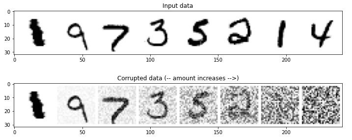
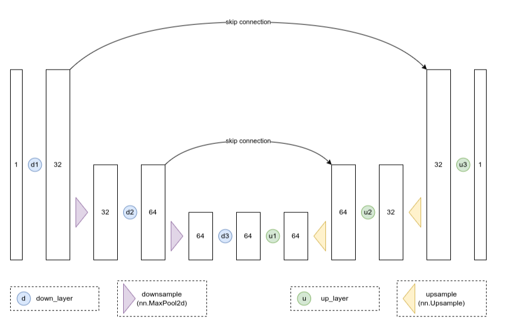
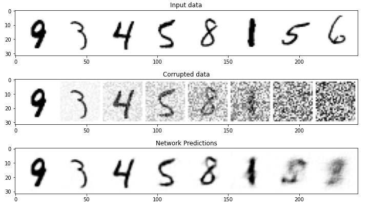
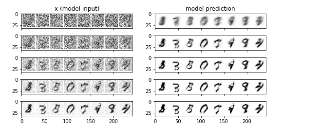
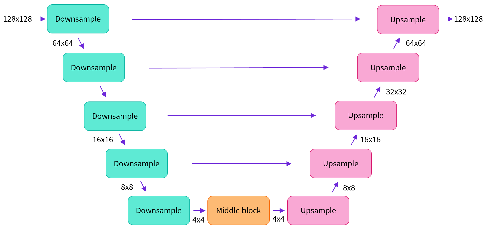
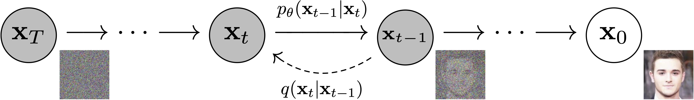
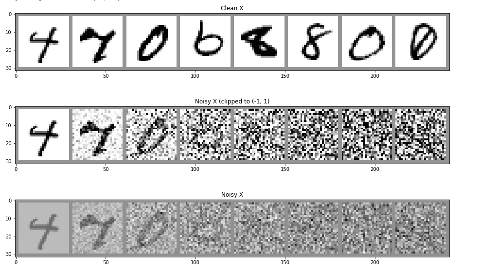

# 扩散模型

## 简介

扩散模型（Diffusion Models）在不同的领域和文献中可能有不同的名称。其中一些常见的名称包括去噪扩散概率模型（ddpm）、基于分数的生成模型（score-based generative models）和生成扩散过程（generative diffusion processes）等等。另外，有些人也将它们称为基于能量的模型（EBMs），从技术上来说，它们可以被归类为这个模型家族的一个特例。但是最贴切的描述应该是**基于分数匹配模型(score-based generative models)**的想法，并使用了基于随机微分方程(SDEs)的形式主义。

扩散模型的构建过程：首先，它描述了将数据转化为噪声的逐步过程，并训练神经网络来学习这个过程。在每个步骤中，都会有带有噪声的输入，然后通过填充被噪音掩盖的信息，使噪声减小一些。最终，通过多次从纯噪声开始并重复这个过程，就可以用这种方法生成数据。

接下来我们主要结合🤗Diffusers这个库来挖掘我们强大的扩散模型。

🤗Diffusers 的核心 API 被分为三个主要部分:

1. **管道**: 从高层出发设计的多种类函数，旨在以易部署的方式，能够做到快速通过主流预训练好的扩散模型来生成样本。一般人只用这个就行了。
2. **模型**: 训练新的扩散模型时用到的主流网络架构，*e.g.* [UNet](https://arxiv.org/abs/1505.04597).
3. **调度器(or 管理器 ，我更喜欢叫调度器)**: 在 *推理* 中使用多种不同的技巧来从噪声中生成图像，同时也可以生成在 *训练* 中所需的带噪图像。我们在训练中，取出真实图像然后对它们增添噪声，在这之后把带噪的图片送入模型。在推理阶段，我们将用模型的预测值来不断迭代去除这些噪点。

例如，这就是一个很简单的pipline：

```python
from diffusers import DDPMPipeline

def make_grid(images, size=64):
    """Given a list of PIL images, stack them together into a line for easy viewing"""
    output_im = Image.new("RGB", (size * len(images), size))
    for i, im in enumerate(images):
        output_im.paste(im.resize((size, size)), (i * size, 0))
    return output_im

# Load the butterfly pipeline
butterfly_pipeline = DDPMPipeline.from_pretrained(
    "johnowhitaker/ddpm-butterflies-32px"
).to(device)

# Create 8 images
images = butterfly_pipeline(batch_size=8).images

# View the result
make_grid(images)
```

`num_inference_steps`和`guidance_scale`分别是采样次数和模型匹配程度

## 扩散理论基础

### 一种简单的Corruption损坏过程

说损坏有点陌生，这个过程实际上就是加噪声的流程。

这里介绍一个很简单的控制加噪的数量，我们设一个公式：$ (1-amount)*x + amount*noise$，这个公式是想说如果amount = 0，我们将返回输入而不进行任何更改。如果amount 达到 1，我们会得到返回噪声，而没有输入 x 的痕迹。试想，如果amount是一个小数，那么它就是在有和无之间，类似于颜色中的不透明度，所以加百分之几的噪声这个公式就能很简单的帮我们实现。

通过以这种方式将输入与噪声混合，我们可以将输出保持在相同的范围内（0 到 1）。

```python
def corrupt(x, amount):
  """Corrupt the input `x` by mixing it with noise according to `amount`"""
  noise = torch.rand_like(x)
  amount = amount.view(-1, 1, 1, 1) # Sort shape so broadcasting works
  return x*(1-amount) + noise*amount 
```

我们使用随机生成x维度一样的噪声数据，例如我们设x的维度是(8,1,28,28)，那么noise的维度也是(8,1,28,28)，amout这里使用view进行变形，为什么这里要广播，我们需要结合下面的代码来看：

```python
# Plotting the input data
fig, axs = plt.subplots(2, 1, figsize=(12, 5))
axs[0].set_title('Input data')
axs[0].imshow(torchvision.utils.make_grid(x)[0], cmap='Greys')

# Adding noise
amount = torch.linspace(0, 1, x.shape[0]) # Left to right -> more corruption
noised_x = corrupt(x, amount)

# Plotting the noised version
axs[1].set_title('Corrupted data (-- amount increases -->)')
axs[1].imshow(torchvision.utils.make_grid(noised_x)[0], cmap='Greys');
```

amount是干什么的？我们使用torch.linspace将0到1平分成8份，因为我们有8张输入的图像，这样可以看到每一张图像从无到逐渐加噪到完整噪声是怎么样的。amout的维度应该是(8)，值为tensor([0.0000, 0.1429, 0.2857, 0.4286, 0.5714, 0.7143, 0.8571, 1.0000])，这样它的维度和x不一样，那么我们就要广播来计算了。广播后的维度是(8,1,1,1)。



### 基础UNet

UNet常常用来接收一个尺寸的噪声图像，**并输出相同形状的预测**。

UNet由一个“压缩路径”和一个“扩展路径”组成。“压缩路径”会使通过该路径的数据被压缩，而通过“扩展路径”会将数据扩展回原始维度（类似于自动编码器）。模型中的残差连接也允许信息和梯度在不同层级之间流动。



```python
class BasicUNet(nn.Module):
    """A minimal UNet implementation."""
    def __init__(self, in_channels=1, out_channels=1):
        super().__init__()
        self.down_layers = torch.nn.ModuleList([ 
            nn.Conv2d(in_channels, 32, kernel_size=5, padding=2),
            nn.Conv2d(32, 64, kernel_size=5, padding=2),
            nn.Conv2d(64, 64, kernel_size=5, padding=2),
        ])
        self.up_layers = torch.nn.ModuleList([
            nn.Conv2d(64, 64, kernel_size=5, padding=2),
            nn.Conv2d(64, 32, kernel_size=5, padding=2),
            nn.Conv2d(32, out_channels, kernel_size=5, padding=2), 
        ])
        self.act = nn.SiLU() # The activation function
        self.downscale = nn.MaxPool2d(2)
        self.upscale = nn.Upsample(scale_factor=2)

    def forward(self, x):
        h = []
        for i, l in enumerate(self.down_layers):
            print(i,l)
            x = self.act(l(x)) # Through the layer and the activation function
            if i < 2: # For all but the third (final) down layer:
              h.append(x) # Storing output for skip connection
              x = self.downscale(x) # Downscale ready for the next layer
              
        for i, l in enumerate(self.up_layers):
            print(i,l)
            if i > 0: # For all except the first up layer
              x = self.upscale(x) # Upscale
              x += h.pop() # Fetching stored output (skip connection)
            x = self.act(l(x)) # Through the layer and the activation function
            
        return x
```

这里的示例代码是一个简单模型，接收了一个28px的单色图像。我们设`x = torch.rand(8, 1, 28, 28)`

UNet在下采样时候，接收图像传入下行路径down_layers（其中有3个卷积层），在卷积后使用SiLU激活函数。在3个卷积层里只有后两个用于跳跃连接，我们使用最大池化进行下采样。

我认为维度变化，可以比图像更直观地看流程变化：

第1次输入:  `torch.Size([8, 1, 28, 28])` 

第1次卷积:  `torch.Size([8, 32, 28, 28]) `，从1通道变成32通道

第1次激活函数:  `torch.Size([8, 32, 28, 28]) `,激活函数不改变维度

第1下采样:  `torch.Size([8, 32, 14, 14])`,使用2×2池化，相当于把图像缩小2倍。

第2次输入:  `torch.Size([8, 32, 14, 14]) `把第一次下采样的结果输入

第2次卷积:  `torch.Size([8, 64, 14, 14]) `,继续扩大成64通道

第2次激活函数:  `torch.Size([8, 64, 14, 14])`，这个时候的结果要保存好，用于上采样的第一个结果相加

第2下采样: ` torch.Size([8, 64, 7, 7]) `继续缩小尺寸

第3次输入:  `torch.Size([8, 64, 7, 7]) `

第3次卷积:  `torch.Size([8, 64, 7, 7]) `

第3次激活函数:  `torch.Size([8, 64, 7, 7])`，用于上采样的第二个结果相加

> 我们发现，我们分别加入第2次和第3次的激活函数结果，但是依次拿来使用，也就是先进后出的队列关系，在python中我们可以直接使用列表，每一次在尾部添加，然后每次相加，使用pop函数把头部删除。

在下采样时候，输入先经过上行路径的第一个卷积层+激活函数，然后先进行上采样加上跳跃的结果，再传入第二层卷积，第三次也是先上采样加跳跃加第三层卷积。

第1输入:  `torch.Size([8, 64, 7, 7]) `

第1卷积: ` torch.Size([8, 64, 7, 7]) `，第一次卷积不改变通道

第1激活函数后:  `torch.Size([8, 64, 7, 7]) `

第2输入:  `torch.Size([8, 64, 7, 7]) `

第2上采样:  `torch.Size([8, 64, 14, 14]) `，开始扩大2倍图像

第2跳跃后:  `torch.Size([8, 64, 14, 14]) `与下采样的第2次激活函数结果直接相加

第2卷积:  `torch.Size([8, 32, 14, 14]) `，缩小通道

第2激活函数后:  `torch.Size([8, 32, 14, 14]) `

第3输入:  `torch.Size([8, 32, 14, 14]) `

第3上采样: ` torch.Size([8, 32, 28, 28]) `

第3跳跃后:  `torch.Size([8, 32, 28, 28]) `

第3卷积:  `torch.Size([8, 1, 28, 28]) `

第3激活函数后: ` torch.Size([8, 1, 28, 28])`

该网络有`sum([p.numel() for p in net.parameters()])`=309057个参数

### 训练模型

接下来我们给定一个损坏的输入noisy_x（即上面的corrupt函数，你可以想象把上面逐渐有噪声的8张图给UNet进行训练），模型应该输出它对原本x的最佳猜测。我们将通过均方误差将预测与真实值进行比较。

主要流程是：

- 获取一批数据
- 添加随机噪声
- 将数据输入模型
- 将模型预测与干净图像进行比较，以计算loss
- 更新模型的参数。

```python
# Dataloader (you can mess with batch size)
batch_size = 128
train_dataloader = DataLoader(dataset, batch_size=batch_size, shuffle=True)

# How many runs through the data should we do?
n_epochs = 3

# Create the network
net = BasicUNet()
net.to(device)

# Our loss function
loss_fn = nn.MSELoss()

# The optimizer
opt = torch.optim.Adam(net.parameters(), lr=1e-3) 

# Keeping a record of the losses for later viewing
losses = []

# The training loop
for epoch in range(n_epochs):

    for x, y in train_dataloader:

        # Get some data and prepare the corrupted version
        x = x.to(device) # Data on the GPU
        noise_amount = torch.rand(x.shape[0]).to(device) # Pick random noise amounts
        noisy_x = corrupt(x, noise_amount) # Create our noisy x

        # Get the model prediction
        pred = net(noisy_x)

        # Calculate the loss
        loss = loss_fn(pred, x) # How close is the output to the true 'clean' x?

        # Backprop and update the params:
        opt.zero_grad()
        loss.backward()
        opt.step()

        # Store the loss for later
        losses.append(loss.item())

    # Print our the average of the loss values for this epoch:
    avg_loss = sum(losses[-len(train_dataloader):])/len(train_dataloader)
    print(f'Finished epoch {epoch}. Average loss for this epoch: {avg_loss:05f}')

# View the loss curve
plt.plot(losses)
plt.ylim(0, 0.1);
```

我们还可以可视化以不同的数量损坏数据，然后喂进模型获得预测来观察结果：

```python
#@markdown Visualizing model predictions on noisy inputs:

# Fetch some data
x, y = next(iter(train_dataloader))
x = x[:8] # Only using the first 8 for easy plotting

# Corrupt with a range of amounts
amount = torch.linspace(0, 1, x.shape[0]) # Left to right -> more corruption
noised_x = corrupt(x, amount)

# Get the model predictions
with torch.no_grad():
  preds = net(noised_x.to(device)).detach().cpu()

# Plot
fig, axs = plt.subplots(3, 1, figsize=(12, 7))
axs[0].set_title('Input data')
axs[0].imshow(torchvision.utils.make_grid(x)[0].clip(0, 1), cmap='Greys')
axs[1].set_title('Corrupted data')
axs[1].imshow(torchvision.utils.make_grid(noised_x)[0].clip(0, 1), cmap='Greys')
axs[2].set_title('Network Predictions')
axs[2].imshow(torchvision.utils.make_grid(preds)[0].clip(0, 1), cmap='Greys');
```

clip将张量中的值限制于0-1之间。这就是一个归一化。



你可以看到，噪声加的少的都能很好的预测，当图像越来越模糊的时候，UNet就识别不了了。

### 采样

好，模糊的图像识别不了怎么办？

这时候就需要采样了，我们的目的是能识别添加了100%噪声的图像，那么它现在都是噪声我们怎么识别，简单来说，我们要从它原来的数据上取部分数据给有噪声的图像融合，容量是一定的，但原数据越来越多时候，噪声便会越来越小。我们可以想象，当我们对一个知识点很模糊的时候，我们一点一点学习已有的知识，我们是不是对这个模糊的点越来越清晰了？

采样就是这样的过程。

假设我们对一个知识原来有5处不懂，我们学习5次，每次学习一个点。

第一次我们先接触知识，假设我们学了第一个知识点，那么对于模糊处我们还有4处没有明白。

第二次继续学习，假设我们就掌握了知识的$\frac{2}{5}$，那么对于模糊处我们还有3/5没有明白。

...依次到

第五次学习，我们掌握了知识的100%，学习完毕。

当然真实采样的时候，我们不是神童，这种知识吸收程度太可怕了，更多时候普通人可能对知识点不是每次都能完全掌握，这个知识点简单，我们一学就通，下个知识点，在老师课堂上，我们只吸收了部分，然后老师又去讲新的去了，所以你对这个难点并不是完全掌握的。

以此，我们模拟正常情况，我们把**”知识存量“**称为x，把**模糊程度**称为pred（你总是从无法理解变成能理解，我们要预测你对知识的掌握程度如何）。

我们慢慢学习，第一次学习后，我们对一个知识掌握了$\frac{4}{5}$，那么你的模糊程度就从1变成了原来的$\frac{1}{5}$，注意这里模糊程度是你从不理解变成理解的程度，原来的$\frac{1}{5}$已经理解好多了。

这时候我们来衡量一下我们下面要学的知识$x_1$=$\frac{4}{5}x+\frac{1}{5}pred$，这是什么意思呢？知识是一种累加过程，你也可以认为，我们第一次学习的知识，在后面的学习还要用到的，然而后面的$\frac{1}{5}$不理解，你也要学习。

第二次学习，我们要转向这个新的知识了，同理现在的知识存量应该是$x_2$=$\frac{3}{4}x_1+\frac{1}{4}pred_1$，这个知识可能更难了。

依次进行，直到第五次，对$x_5$，模糊程度可能还有，但总比第一次学习时候清楚了。

这里的流程可以写成代码：

```python
#@markdown Sampling strategy: Break the process into 5 steps and move 1/5'th of the way there each time:
n_steps = 5
x = torch.rand(8, 1, 28, 28).to(device) # Start from random
step_history = [x.detach().cpu()]
pred_output_history = []

for i in range(n_steps):
    with torch.no_grad(): # No need to track gradients during inference
        pred = net(x) # Predict the denoised x0
    pred_output_history.append(pred.detach().cpu()) # Store model output for plotting
    mix_factor = 1/(n_steps - i) # How much we move towards the prediction
    x = x*(1-mix_factor) + pred*mix_factor # Move part of the way there
    step_history.append(x.detach().cpu()) # Store step for plotting

fig, axs = plt.subplots(n_steps, 2, figsize=(9, 4), sharex=True)
axs[0,0].set_title('x (model input)')
axs[0,1].set_title('model prediction')
for i in range(n_steps):
    axs[i, 0].imshow(torchvision.utils.make_grid(step_history[i])[0].clip(0, 1), cmap='Greys')
    axs[i, 1].imshow(torchvision.utils.make_grid(pred_output_history[i])[0].clip(0, 1), cmap='Greys')
```

我们可以结合下面图像可以看到清晰得变懂了：



多吃吃补品，多多运动，少些不健康的事情啊，你就变得越来越聪明，越来越帅气，或者勤能补拙，多训练会，你对知识的模糊程度只会越来越低了，哈哈哈。

## 与 DDPM 做比较

上面呀，只是简单的低级位面，而DDPM它是一叶一世界，它是一个高级位面，它掌管多个低级位面。规则法典又不太相同，比低级位面高级太多了。

具体表现在：

1. 该模型通过调节timestep来调节噪声水平, 其中t作为一个附加参数传入前向过程中。原来的UNet只要传入噪声，下面我们还要传入时间步长。
2. 损坏过程的处理方式不同，前面只是一个简单的加噪函数
3. 有许多采样策略
4. diffusers`UNet2DModel`比我们的BasicUNet更先进
5. 训练目标不同，包括预测噪声而不是去噪图像。这里为什么这么说？在前面的示例代码，我们是输入噪声，然后与真实数据进行对比，注意了，如果DDPM只是恢复原图，那它凭什么生成不同图像。我们的主要目的变成，我们不是把它还原，而是通过噪声，影响识别它的样子，所以我们应该训练带有噪声的图像。

### 模型

UNet2DModel 模型比上面的基本 UNet 有许多改进：

- 对每个blocks的输入进行了组标准化，group normalization
- 使用了Dropout，让训练更平滑
- 每个块多了resnet层！
- 注意力机制来了！（通常仅用于较低分辨率的块，来减少内存消耗）
- 增加新的输入条件：时间步长（timestep）
- 具有可学习参数的下采样和上采样块

```
model = UNet2DModel(
    sample_size=28,           # the target image resolution
    in_channels=1,            # the number of input channels, 3 for RGB images
    out_channels=1,           # the number of output channels
    layers_per_block=2,       # how many ResNet layers to use per UNet block
    block_out_channels=(32, 64, 64), # Roughly matching our basic unet example
    down_block_types=( 
        "DownBlock2D",        # a regular ResNet downsampling block
        "AttnDownBlock2D",    # a ResNet downsampling block with spatial self-attention
        "AttnDownBlock2D",
    ), 
    up_block_types=(
        "AttnUpBlock2D", 
        "AttnUpBlock2D",      # a ResNet upsampling block with spatial self-attention
        "UpBlock2D",          # a regular ResNet upsampling block
      ),
)
print(model)
```

打印结果太长了，哎。

它的参数量变成1707009（170万），原来是309057（30万）

概括来说:

- 输入模型中的图片经过几个由 ResNetLayer构成的层，其中每层都使图片尺寸减半。基础的是用池化方式
- 之后在经过同样数量的层把图片升采样。
- 其中还有对特征在相同位置的上、下采样层残差连接模块。

这里`down_block_types`对应下采样模块 (下图中绿色部分), 而`up_block_types`对应上采样模块 (下图中红色部分):



### 损坏过程



*图来自 DDPM 论文 (https://arxiv.org/abs/2006.11239)。*

DDPM论文描述了一个为每个“timestep”添加少量噪声的损坏过程。 为某些timestep给定 $x_{t-1}$  ,我们可以得到一个噪声稍稍增加的  $x_t$:
$$
q(\mathbf{x}_t \vert \mathbf{x}_{t-1}) = \mathcal{N}(\mathbf{x}_t; \sqrt{1 - \beta_t} \mathbf{x} _{t-1}, \beta_t\mathbf{I}) \quad q(\mathbf{x}_{1:T} \vert \mathbf{x}_0) = \prod^T_{t=1} q (\mathbf{x}_t \vert \mathbf{x}_{t-1})
$$
$q(\mathbf{x}_t \vert \mathbf{x}_{t-1}) = \mathcal{N}(\mathbf{x}_t; \sqrt{1 - \beta_t} \mathbf{x}_{t-1}, \beta_t\mathbf{I})$这表示在给定前一个timestep的状态 $x_{t-1}$ 的条件下，当前timestep的状态 $x_{t}$ 服从均值为$\sqrt{1 - \beta_t} \mathbf{x} _{t-1} $，方差为$\beta_t\mathbf{I}$的多元正态分布。这里的$\beta_t$通常是一个表示系统动力学特性或噪声程度的参数。

$q(\mathbf{x}_{1:T} \vert \mathbf{x}_0) = \prod^T_{t=1} q (\mathbf{x}_t \vert \mathbf{x}_{t-1})$这表示整个状态序列$\mathbf{x}_{1:T}$在给定初始状态$x_0$的条件下，可以被分解为每一时刻的条件概率的连乘积。换句话说，这个公式表示整个状态序列的联合分布可以被分解为各个时刻的条件分布的连乘积，这正是马尔可夫链的性质所在，即当前状态仅依赖于前一个状态。

我们给 $x_{t-1}$ 一个 $\sqrt{1 - \beta_t}$ 系数，然后加上带有 $\beta_t$ 系数的噪声 。这个 $\beta$  是根据调度器为每个 t 定义的，决定每一个迭代周期中添加多少噪声。 

但上面的公式你会发现，我们要计算好多次，从$x_1$算到$x_2$一直算到$x_n$。所以我们用一个一步到位的公式：

$\begin{aligned}q(\mathbf{x}_t \vert \mathbf{x}_0) &= \mathcal{N}(\mathbf{x}_t; \sqrt{\bar{\alpha}_t} \mathbf{x}_0, \sqrt{(1 - \bar{\alpha}_t)} \mathbf{I})\end{aligned}$ where $\bar{\alpha}_t = \prod_{i=1}^T \alpha_i$ and $\alpha_i = 1-\beta_i$

这个公式表示了在给定初始状态 $x_0$的条件下，当前tiemstept的状态$x_t$的概率分布。具体来说，它表示$x_t$ 在均值为 $\sqrt{\bar{\alpha}_t} \mathbf{x}_0$，方差为$\sqrt{(1 - \bar{\alpha}_t)} \mathbf{I}$ 的多元正态分布中的概率分布。其中，$\bar{\alpha}_t$是一个关于时间的累积参数，由所有时间步长内的 $\alpha_i$乘积得到，而 $\alpha_i$则是与$\beta_i$相关的参数。

在迭代过程中，$\sqrt{\bar{\alpha}_t}$越来越小，$\sqrt{(1 - \bar{\alpha}_t)}$越来越大。也就是说噪声越来越大了。

我们可视化一下：

```python
#@markdown visualize the DDPM noising process for different timesteps:

# Noise a batch of images to view the effect
fig, axs = plt.subplots(3, 1, figsize=(16, 10))
xb, yb = next(iter(train_dataloader))
xb = xb.to(device)[:8]
xb = xb * 2. - 1. # Map to (-1, 1)
print('X shape', xb.shape)

# Show clean inputs
axs[0].imshow(torchvision.utils.make_grid(xb[:8])[0].detach().cpu(), cmap='Greys')
axs[0].set_title('Clean X')

# Add noise with scheduler
timesteps = torch.linspace(0, 999, 8).long().to(device)
noise = torch.randn_like(xb) # << NB: randn not rand
noisy_xb = noise_scheduler.add_noise(xb, noise, timesteps)
print('Noisy X shape', noisy_xb.shape)

# Show noisy version (with and without clipping)
axs[1].imshow(torchvision.utils.make_grid(noisy_xb[:8])[0].detach().cpu().clip(-1, 1),  cmap='Greys')
axs[1].set_title('Noisy X (clipped to (-1, 1)')
axs[2].imshow(torchvision.utils.make_grid(noisy_xb[:8])[0].detach().cpu(),  cmap='Greys')
axs[2].set_title('Noisy X');
```



> 在DDPM版本是从高斯分布上提取的噪声（来自均值0方差1的torch.randn），而不是上面的corrupt函数（ 0-1之间的均匀分布，torch.rand）。
>
> `torch.randn` 生成的是从标准正态分布中采样的随机数，因此它的值可以在负无穷到正无穷之间，所以这里使用clip限制在-1，1之间。
>
> 而 `torch.rand` 生成的随机数范围在 `[0, 1)` 内，所以在前面示例的代码使用clip限制在-1和1之间。

上面公式太复杂了，好在调度器，它帮我们简化了这样的计算，在diffusers中，我们可以这样使用：

```python
def show_images(x):
    """Given a batch of images x, make a grid and convert to PIL"""
    x = x * 0.5 + 0.5  # Map from (-1, 1) back to (0, 1)
    grid = torchvision.utils.make_grid(x)
    grid_im = grid.detach().cpu().permute(1, 2, 0).clip(0, 1) * 255
    grid_im = Image.fromarray(np.array(grid_im).astype(np.uint8))
    return grid_im

from diffusers import DDPMScheduler
noise_scheduler = DDPMScheduler(num_train_timesteps=1000)
timesteps = torch.linspace(0, 999, 8).long().to(device)
noise = torch.randn_like(xb)
noisy_xb = noise_scheduler.add_noise(xb, noise, timesteps)
print("Noisy X shape", noisy_xb.shape)
show_images(noisy_xb).resize((8 * 64, 64), resample=Image.NEAREST)
```


### 训练目标

在前面的简单实例中，我们让模型尝试预测去噪图像。在DDPM和许多其他扩散模型实现中，**我们让模型尝试预测去噪图像。在DDPM和许多其他扩散模型实现中，模型则会预测损坏过程中使用的噪声**。

```python
noise = torch.randn_like(xb) # randn不是rand！
noisy_x = noise_scheduler.add_noise(x, noise, timesteps)
model_prediction = model(noisy_x, timesteps).sample
loss = mse_loss(model_prediction, noise) # noise as the target
```

这个道理我在前面说过，为什么使用扩散模型的目的是送入噪声干扰图片，生成新的图片。我们在训练时候对比也是和噪声之间的区别，而不是预测和原图之间的区别，所以加入噪声更是我们需要的关注。我们在DDPM中加了timestep，我们可以看到它处理的噪声是累积的过程，生成的噪声有明显的也有不明显的，这些管理器还要控制不明显的，在后续生成时候给予更多的权重，不然你想，我把一只猫变成虎，额头我没有增加明显的噪声，形成不了王字怎么办~

UNet2DModel 接受 x 和timestep。后者被转化为嵌入（embedding）并在多个地方输入到模型中。通过为模型提供有关噪声水平的信息，它可以更好地执行其任务。虽然可以在没有这种时间步条件的情况下训练模型，但在某些情况下它似乎确实有助于提高性能，并且大多数实现都包含它，至少在当前的文献中是这样。（玄学来了）

下面这是 PyTorch 中经典的优化迭代循环，在这里一批一批的送入数据然后通过优化器来一步步更新模型参数 - 在这个样例中我们使用学习率为 0.0004 的 AdamW 优化器。

对于每一批的数据，我们要

- 随机取样几个迭代周期
- 根据预设为数据加入噪声
- 把带噪数据和timesteps送入模型
- 使用 MSE 作为损失函数来比较加入的噪声与模型预测结果差距在哪。结果越小越好，说明这个噪声我们能把控住，我们就能在现有基础上来操刀，把它整容。
- 通过`loss.backward ()`与`optimizer.step ()`来更新模型参数

```python
# Set the noise scheduler
noise_scheduler = DDPMScheduler(
    num_train_timesteps=1000, beta_schedule="squaredcos_cap_v2"
)

# Training loop
optimizer = torch.optim.AdamW(model.parameters(), lr=4e-4)

losses = []

for epoch in range(30):
    for step, batch in enumerate(train_dataloader):
        clean_images = batch["images"].to(device)
        # Sample noise to add to the images
        noise = torch.randn(clean_images.shape).to(clean_images.device)
        bs = clean_images.shape[0]

        # Sample a random timestep for each image
        # 分为batsize份
        timesteps = torch.randint(
            0, noise_scheduler.num_train_timesteps, (bs,), device=clean_images.device
        ).long()

        # Add noise to the clean images according to the noise magnitude at each timestep
        noisy_images = noise_scheduler.add_noise(clean_images, noise, timesteps)

        # Get the model prediction
        noise_pred = model(noisy_images, timesteps, return_dict=False)[0]

        # Calculate the loss
        loss = F.mse_loss(noise_pred, noise)
        loss.backward(loss)
        losses.append(loss.item())

        # Update the model parameters with the optimizer
        optimizer.step()
        optimizer.zero_grad()

    if (epoch + 1) % 5 == 0:
        loss_last_epoch = sum(losses[-len(train_dataloader) :]) / len(train_dataloader)
        print(f"Epoch:{epoch+1}, loss: {loss_last_epoch}")
```


### 采样

有一个模型可以用来预测在带噪样本中的噪声，我们怎么用它来生成图像呢？

```python
# 1. 建立一个管道：
from diffusers import DDPMPipeline
image_pipe = DDPMPipeline(unet=model, scheduler=noise_scheduler)
pipeline_output = image_pipe()
pipeline_output.images[0]
#保存管道：image_pipe.save_pretrained("my_pipeline")

#2. 写一个取样循环
# Random starting point (8 random images):
sample = torch.randn(8, 3, 32, 32).to(device)

for i, t in enumerate(noise_scheduler.timesteps):

    # Get model pred
    with torch.no_grad():
        residual = model(sample, t).sample

    # Update sample with step
    sample = noise_scheduler.step(residual, t, sample).prev_sample

show_images(sample)
```

最理想的状态是，我们可以给入纯噪声，就希望模型能一步就输出一个不带噪声的好图像。但是这通常行不通。所以，我们在模型预测的基础上一步一步，迭代着来每次去除一点点噪声。

这里与前面的差不多，因为采样就是去除噪声，但这里不是说还原图像，而是生成新的图像了。

只不过是采样的策略不同，这跟不同的扩散模型有关
