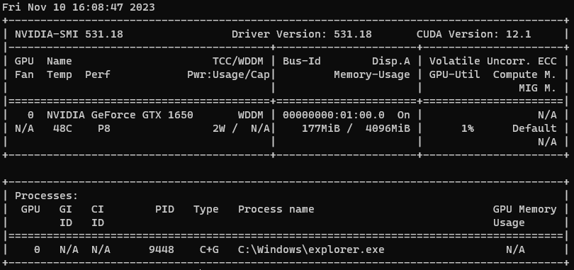
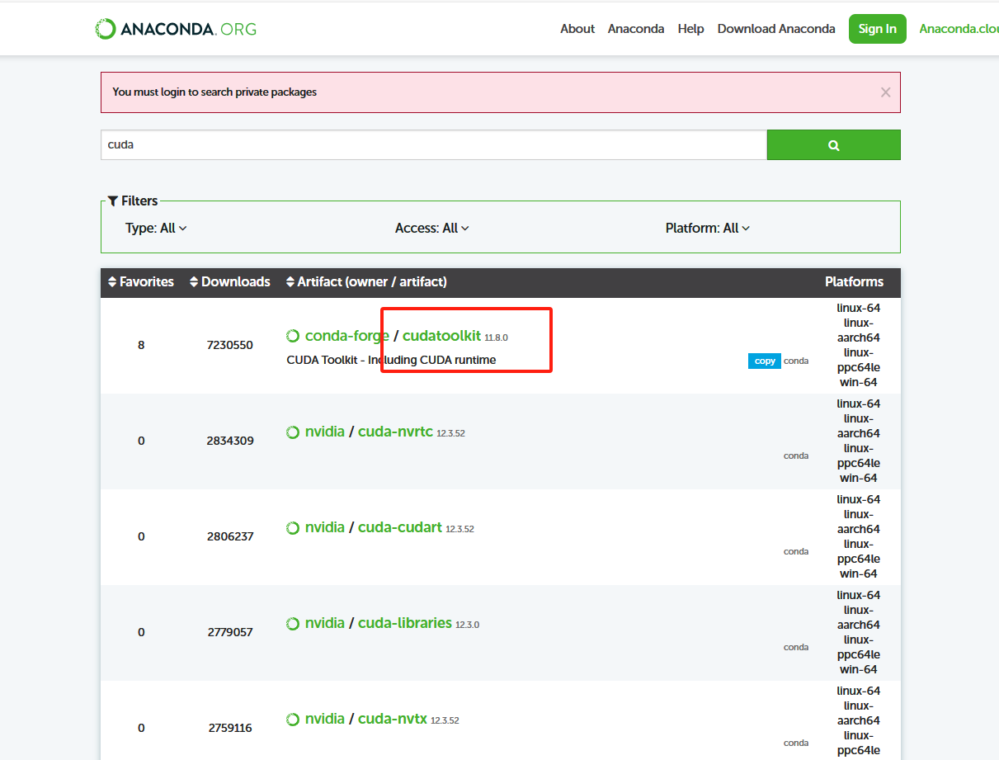

# Pytorch从入门到弃坑

## 第一章：虚拟环境和PyTorch安装

### Anaconda/miniconda安装

windows:https://www.anaconda.com/download

linux:https://www.anaconda.com/download

### conda一些命令

查看现存虚拟环境：`conda env list`

创建虚拟环境:`conda create -n env_name python==version `

> 在选择Python版本时,建议选择3.6-3.8，版本过高会导致相关库不适配

安装包：`conda install package_name `

卸载包：`conda remove package_name `

更新包：`conda update --name env_name package_name`

显示所有安装的包：`conda list`

删除虚拟环境命令：`conda remove -n env_name --all `

激活环境命令：`conda activate env_name`，在Linux/超算上一般是`source activate env_name`

退出当前环境：`conda deactivate` ，在Linux/超算上一般是`source deactivate`

查询可用的包：`conda search $SEARCH_TERM`

克隆环境：`conda create -n B --clone A`，新环境名字是B，**注意在这里修改A的环境也会影响到B**，修改B不影响A

### 换源

#### pip换源

##### Linux：

Linux下的换源，我们首先需要在用户目录下新建文件夹`.pip`，并且在文件夹内新建文件`pip.conf`，具体命令如下

```
cd ~
mkdir .pip/
vi pip.conf
```

随后，我们需要在`pip.conf`添加下方的内容:

```
[global]
index-url = http://pypi.douban.com/simple
[install]
use-mirrors =true
mirrors =http://pypi.douban.com/simple/
trusted-host =pypi.douban.com
```

##### Windows：

1、进入 `C:\Users\电脑用户\` 文件夹中 2、新建 pip 文件夹并在文件夹中新建 `pip.ini` 配置文件 3、我们需要在`pip.ini` 配置文件内容，我们可以选择使用记事本打开，输入以下内容，并按下ctrl+s保存，在这里我们使用的是豆瓣源为例子。

```
[global]
index-url = http://pypi.douban.com/simple
[install]
use-mirrors =true
mirrors =http://pypi.douban.com/simple/
trusted-host =pypi.douban.com
```

#### conda换源（清华源）

##### Windows系统：

各系统都可以通过修改用户目录下的 `.condarc` 文件。Windows 用户无法直接创建名为 `.condarc` 的文件，可先执行`conda config --set show_channel_urls yes`生成该文件之后再修改。

[官方换源帮助](https://mirrors.tuna.tsinghua.edu.cn/help/anaconda/)

完成这一步后，这一步完成后，我们需要打开`Anaconda Prompt` 运行 `conda clean -i` 清除索引缓存，保证用的是镜像站提供的索引。

##### Linux系统：

在Linux系统下，我们还是需要修改`.condarc`来进行换源

```
cd ~
vi .condarc
```

在`vim`下，我们需要输入`i`进入编辑模式，将上方内容粘贴进去，按`ESC`退出编辑模式，输入`:wq`保存并退出，我们可以通过`conda config --show default_channels`检查下是否换源成功。同时，我们仍然需要`conda clean -i` 清除索引缓存，保证用的是镜像站提供的索引。

### 查看显卡

命令行输入`nvidia-smi`



在这里，重要的是看CUDA Version，这说明在此驱动下，当前CUDA版本及其最高版本是12.1。

### 安装Pytorch

老方法：百度一下吧，如果版本太高了，没有Pytorch对应的版本，就要选择降级，下载[CUDA](https://developer.nvidia.com/cuda-downloads/)（注意通过官网下载安装的CUDA Toolkit包括驱动，因此再执行`nvidia-smi`，CUDA版本会改变），然后去[官网](https://developer.nvidia.com/rdp/cudnn-archive)下载对应的CUDNN安装包，下载的cuDNN是一个压缩文件，将其解压到CUDA安装目录，**最后配置环境变量**。

预备工作完毕之后，去pytorch官网复制安装命令，网址：https://pytorch.org/get-started/locally/

建议使用conda安装，选择正确的版本后，复制下载指令，

注意：

1. `conda install pytorch torchvision torchaudio pytorch-cuda=11.8 -c pytorch -c nvidia`，pytorch-cuda=11.8是帮你安装cuda-toolkit11.8，如果你想要使用你裸机版本，要把这个给删除了。在老版本中是直接叫cuda-toolkit的。

2.  -c 去掉以保证使用清华源下载，否则还是默认从官网下载。
3. 所以你看看，不给你安装cudnn，这能用吗？

----

回归，

**实际上，我感觉这种方法最好**，`nvidia-smi`的作用是帮助我们来看CUDA支持最高的版本是什么，我们可以用conda**安装独立的每个环境专属的conda版本**，不用在自己裸机安装CUDA，不然每次pytorch更新一次，你就要重复安装cuda和cudnn，还要配置环境，不累吗？当然版本你还是不能超过裸机检查到的CUDA最高版本。

使用conda安装的cuda-toolkit是不包含驱动的，所以不会影响到裸机的CUDA版本。

来到https://anaconda.org/search?q=cuda搜索cuda，然后你就能发现，



这里会有cuda的镜像。

由于国内镜像，像清华，有时候不会把这些版本都存在加速的，因此最好的方法是我们点击详情，点击[Files](https://anaconda.org/conda-forge/cudatoolkit/files)，找到合适的CUDA和系统版本，然后下载。

通过命令`conda install --use-local 包名`进行安装，cudnn也通过[这样的方式](https://anaconda.org/conda-forge/cudnn/files)安装，但你一定应CUDA版本的CUDNN，注意不是去官网下载，官网下载的不是conda包。

## 第二章：PyTorch基础知识

### 张量

#### 简介

几何代数中定义的张量是基于向量和矩阵的推广，比如我们可以将标量视为零阶张量，矢量可以视为一阶张量，矩阵就是二阶张量。

| 张量维度 | 代表含义                                         |
| -------- | ------------------------------------------------ |
| 0维张量  | 代表的是标量（数字）                             |
| 1维张量  | 代表的是向量                                     |
| 2维张量  | 代表的是矩阵                                     |
| 3维张量  | 时间序列数据 股价 文本数据 单张彩色图片(**RGB**) |

张量是现代机器学习的基础。它的核心是一个数据容器，多数情况下，它包含数字，有时候它也包含字符串，但这种情况比较少。因此可以把它想象成一个数字的水桶。

这里有一些存储在各种类型张量的公用数据集类型：

- **3维 = 时间序列**
- **4维 = 图像**
- **5维 = 视频**

例子：一个图像可以用三个字段表示：

```
(width, height, channel) = 3D
```

但是，在机器学习工作中，我们经常要处理不止一张图片或一篇文档——我们要处理一个集合。我们可能有10,000张郁金香的图片，这意味着，我们将用到4D张量：

```
(batch_size, width, height, channel) = 4D
```

#### 创建tensor

1. 随机初始化矩阵 我们可以通过`torch.rand()`的方法，构造一个随机初始化的矩阵：

```
import torch
x = torch.rand(4, 3) 
print(x)
```

```
tensor([[0.7569, 0.4281, 0.4722],
        [0.9513, 0.5168, 0.1659],
        [0.4493, 0.2846, 0.4363],
        [0.5043, 0.9637, 0.1469]])
```


2. 全0矩阵的构建 我们可以通过`torch.zeros()`构造一个矩阵全为 0，并且通过`dtype`设置数据类型为 long。

```
import torch
x = torch.zeros(4, 3, dtype=torch.long)
print(x)
```

```
tensor([[0, 0, 0],
        [0, 0, 0],
        [0, 0, 0],
        [0, 0, 0]])
```

3. 例如，如果你有一个形状为 (3, 4) 的张量 `x`，并且你调用`torch.zero_()` 或`torch.zeros_like(x)`，你将得到一个形状为 (3, 4)、所有元素都是零的新张量。

```
import torch

x = torch.rand(4, 3)
# 使用 torch.zeros_like 创建一个形状为 (3, 4) 的零张量
zero_tensor = torch.zeros_like(x)
# zero_tensor = torch.zero_(x)

print(zero_tensor)
```

```
tensor([[0, 0, 0, 0],
        [0, 0, 0, 0],
        [0, 0, 0, 0]])
```

4. 张量的构建 我们可以通过`torch.tensor()`直接使用数据，构造一个张量：

```
import torch
x = torch.tensor([5.5, 3]) 
print(x)
```

```
tensor([5.5000, 3.0000])
```

5. 基于已经存在的 tensor，创建一个 tensor ：

```
x = x.new_ones(4, 3, dtype=torch.double) 
# 创建一个新的全1矩阵tensor，返回的tensor默认具有相同的torch.dtype和torch.device
# 也可以像之前的写法 x = torch.ones(4, 3, dtype=torch.double)
print(x)
x = torch.randn_like(x, dtype=torch.float)
# 重置数据类型
print(x)
# 结果会有一样的size
# 获取它的维度信息
print(x.size())
print(x.shape)
```

```
tensor([[1., 1., 1.],
        [1., 1., 1.],
        [1., 1., 1.],
        [1., 1., 1.]], dtype=torch.float64)
tensor([[ 2.7311, -0.0720,  0.2497],
        [-2.3141,  0.0666, -0.5934],
        [ 1.5253,  1.0336,  1.3859],
        [ 1.3806, -0.6965, -1.2255]])
torch.Size([4, 3])
torch.Size([4, 3])
```

返回的torch.Size其实是一个tuple，⽀持所有tuple的操作。我们可以使用索引操作取得张量的长、宽等数据维度。

1. 常见的构造Tensor的方法：

|                函数 | 功能                                              |
| ------------------: | ------------------------------------------------- |
|       Tensor(sizes) | 基础构造函数                                      |
|        tensor(data) | 类似于np.array                                    |
|         ones(sizes) | 全1                                               |
|        zeros(sizes) | 全0                                               |
|          eye(sizes) | 对角为1，其余为0                                  |
|    arange(s,e,step) | 从s到e，步长为step                                |
| linspace(s,e,steps) | 从s到e，均匀分成step份                            |
|   rand/randn(sizes) | rand是[0,1)均匀分布；randn是服从N(0，1)的正态分布 |
|    normal(mean,std) | 正态分布(均值为mean，标准差是std)                 |
|         randperm(m) | 随机排列                                          |

#### 张量的操作

1. 加法操作：

```
import torch
# 方式1
y = torch.rand(4, 3) 
print(x + y)

# 方式2
print(torch.add(x, y))

# 方式3 in-place，原值修改
y.add_(x) 
print(y)
```

```
tensor([[ 2.8977,  0.6581,  0.5856],
        [-1.3604,  0.1656, -0.0823],
        [ 2.1387,  1.7959,  1.5275],
        [ 2.2427, -0.3100, -0.4826]])
tensor([[ 2.8977,  0.6581,  0.5856],
        [-1.3604,  0.1656, -0.0823],
        [ 2.1387,  1.7959,  1.5275],
        [ 2.2427, -0.3100, -0.4826]])
tensor([[ 2.8977,  0.6581,  0.5856],
        [-1.3604,  0.1656, -0.0823],
        [ 2.1387,  1.7959,  1.5275],
        [ 2.2427, -0.3100, -0.4826]])
```


2. 索引操作：(类似于numpy)

**需要注意的是：索引出来的结果与原数据共享内存，修改一个，另一个会跟着修改。如果不想修改，可以考虑使用copy()等方法**

```
import torch
x = torch.rand(4,3)
# 取第二列
print(x[:, 1]) 
```

```
tensor([-0.0720,  0.0666,  1.0336, -0.6965])
```

```
y = x[0,:]
y += 1
print(y)
print(x[0, :]) # 源tensor也被改了了
```

```
tensor([3.7311, 0.9280, 1.2497])
tensor([3.7311, 0.9280, 1.2497])
```

3. 维度变换 张量的维度变换常见的方法有`torch.view()`和`torch.reshape()`

```
x = torch.randn(4, 4)
y = x.view(16)
z = x.view(-1, 8) # -1是指这一维的维数由其他维度决定
print(x.size(), y.size(), z.size())
```

```
torch.Size([4, 4]) torch.Size([16]) torch.Size([2, 8])
```

注: `torch.view()` 返回的新`tensor`与源`tensor`共享内存(其实是同一个`tensor`)，更改其中的一个，另外一个也会跟着改变。(顾名思义，view()仅仅是改变了对这个张量的观察角度)

```
x += 1
print(x)
print(y) # 也加了了1

```

```
tensor([[ 1.3019,  0.3762,  1.2397,  1.3998],
        [ 0.6891,  1.3651,  1.1891, -0.6744],
        [ 0.3490,  1.8377,  1.6456,  0.8403],
        [-0.8259,  2.5454,  1.2474,  0.7884]])
tensor([ 1.3019,  0.3762,  1.2397,  1.3998,  0.6891,  1.3651,  1.1891, -0.6744,
         0.3490,  1.8377,  1.6456,  0.8403, -0.8259,  2.5454,  1.2474,  0.7884])
```

上面我们说过torch.view()会改变原始张量，但是很多情况下，我们希望原始张量和变换后的张量互相不影响。为了使创建的张量和原始张量不共享内存，我们需要使用第二种方法`torch.reshape()`， 同样可以改变张量的形状，但是此函数并不能保证返回的是其拷贝值，所以官方不推荐使用。

<u>推荐的方法是我们先用 `clone()` 创造一个张量副本然后再使用 `torch.view()`进行函数维度变换 。</u>

注：使用 `clone()` 还有一个好处是会被记录在计算图中，即梯度回传到副本时也会传到源 Tensor 。

4. 取值操作 如果我们有一个元素 `tensor` ，我们可以使用 `.item()` 来获得这个 `value`，而不获得其他性质：

```
import torch
x = torch.randn(1) 
print(type(x)) 
print(type(x.item()))

```

```
<class 'torch.Tensor'>
<class 'float'>
```

PyTorch中的 Tensor 支持超过一百种操作，包括转置、索引、切片、数学运算、线性代数、随机数等等

#### 广播机制

当对两个形状不同的 Tensor 按元素运算时，可能会触发广播(broadcasting)机制：先适当复制元素使这两个 Tensor 形状相同后再按元素运算。

```
x = torch.arange(1, 3).view(1, 2)
print(x)
y = torch.arange(1, 4).view(3, 1)
print(y)
print(x + y)

```

```
tensor([[1, 2]])
tensor([[1],
        [2],
        [3]])
tensor([[2, 3],
        [3, 4],
        [4, 5]])
```

由于x和y分别是1行2列和3行1列的矩阵，如果要计算x+y，那么x中第一行的2个元素被广播 (复制)到了第二行和第三行，⽽y中第⼀列的3个元素被广播(复制)到了第二列。如此，就可以对2个3行2列的矩阵按元素相加。

广播的条件是：

1. 每个张量的维度至少为1
2. 满足右对齐（就是看维度的最后一个，也就是最右侧的维度，看是否一致）
   1. 右对齐不满足时的特例：不满足右对齐的维度为1可以自动补齐

更多张量知识看https://zhuanlan.zhihu.com/p/601792894