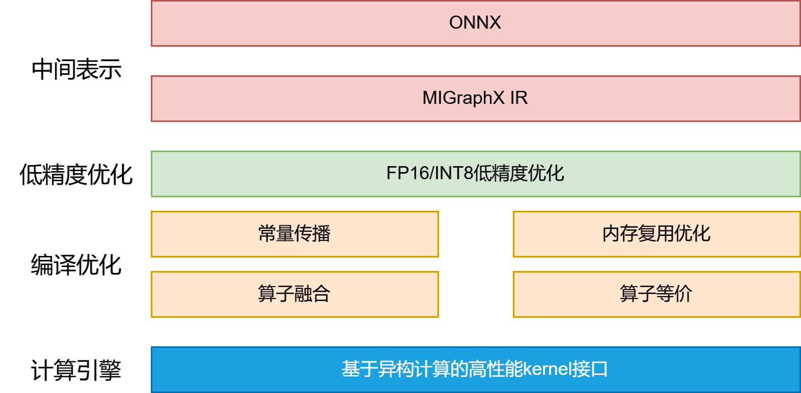

## MIGraphX推理框架

### 简介

MIGraphX是一款用于**DCU**上的深度学习推理引擎。MIGraphX能将深度学习框架（Tensorflow,Pytorch等）训练好的算法模型转换为MIGraphX IR表示的计算图，并提供端到端的模型优化、代码⽣成以及推理业务部署能⼒ 。 MIGraphX致⼒于为用户提供灵活、易⽤的编程接⼝以及配套⼯具，让用户能够专注于推理业务开发和部署本⾝ ，而无需过多关注底层硬件细节，显著提高用户的开发效率。

### 特性

- 支持多种精度推理，比如FP32，FP16，INT8 
- 支持多语言API，包括C++和Python 
- 支持动态shape 
- 支持模型序列化 
- 支持调试 
- 提供性能分析⼯具

#### 整体架构



- 中间表示层：用户训练好的算法模型（onnx）会统⼀转换为用MIGraphX IR 表示的计算图，后续的模型优化和代码生成都基于该计算图完成。
- 编译优化层：基于MIGraphX IR完成各种优化，比如常量折叠，内存复用优化，算子融合等，提高推理性能。 
- 计算引擎层：主要包含了底层计算库的接口，包括MIOpen和rocblas，MIGraphX后端的实现主要是通过调用计算库的方式实现的

AI编译中的IR从层级上分一般可以分为两种类型：多级IR和单级IR。使用多级IR可以使得系统优化更加灵
活，各级IR只需要负责本级优化，多级IR的代表就是MLIR，但是多级IR会带来如下的问题：

1. 需要在不同IR之间进行转换，IR转换做到完全兼容很难而且工作量大。
2. 不同IR转换可能带来信息的损失。
3. 多级IR有些优化既可以在上一层IR进行， 也可以在下一层IR进行， 让系统开发者很难选择。
   MIGraphX采用了单级IR的设计，这种形式的IR可以表达计算图中的控制流信息和数据依赖关系，方便后
   面的编译优化。

MIGraphX采用静态图模式，在编译优化阶段，MIGrahpX实现了如下的优化：

1. 机器无关优化：比如删除公共子表达式，删除无用的代码，常量传播，常量折叠，代数化简，算子
   融合等。
2. 内存复用优化：MIGraphX采用了图着色的方法实现无计算依赖的节点间的内存复用，显著减低内
   存消耗。
3. 指令调度：根据计算图分析指令之间的依赖关系，根据这些依赖关系优化各指令的执行顺序，从而
   提高计算性能。

#### 支持的算子

`migraphx-driver onnx -l`查看支持的onnx算子

#### 支持的模型

目前 MIGraphX支持常用的 CNN 、LSTM 、Transformer和Bert等模型：

1. Classification：AlexNet，VGG，Inception，ResNet，DenseNet，EfficientNet等
2. Detection ：SSD，YOLO，DBNet等
3. Segmentation ：FCN，UNet，MaskRCNN等
4. LSTM：CRNN等
5. Transformer：Vision Transformer（ViT）等
6. BERT：BERT-Squad等

### 安装方法

- 使用镜像(推荐) 下载地址：https://sourcefind.cn/#/main-page，根据需要选择合适的镜像 

例如`docker pull image.sourcefind.cn:5000/dcu/admin/base/migraphx:4.0.0-centos7.6-dtk23.04.1-py38-latest`

在使用MIGraphX之前，需要设置容器中的环境变量：`source /opt/dtk/env.sh`，如果需要在python中使用migraphx，还需要设置PYTHONPATH ：`export PYTHONPATH=/opt/dtk/lib:$PYTHONPATH`

- 使用安装包，安装包下载地址：https://cancon.hpccube.com:65024/4/main/migraphx，根据不同的系统选择合适的安装包
  - 安装dtk，上面的光源dtk镜像或者[安装包](https://cancon.hpccube.com:65024/1/main)，然后将下载好的安装包安装到/opt目录下，最后创建一个软连接/opt/dtk，使得该软连接指向dtk的安装目录，注意：一定要创建软连接/opt/dtk，否则MIGraphX无法正常使用。
  - 安装half`wget https://github.com/pfultz2/half/archive/1.12.0.tar.gz`,解压（`tar -xvf ...tar.gz`）后将include目录下的half.hpp拷贝到dtk目录下的include目录：`cp half-1.12.0/include/half.hpp /opt/dtk/include/`
  - 安装sqlite:[下载地址](https://www.sqlite.org/download.html)，解压，切换目录，然后`./configure && make && make install`，最后设置环境变量：`export PKG_CONFIG_PATH=/usr/local/lib/pkgconfig:$PKG_CONFIG_PATH`和`export LD_LIBRARY_PATH=/usr/local/lib/:$LD_LIBRARY_PATH`
  - 下载MIGraphX: centos还要同时下载devel包
  - 设置环境变量：`source /opt/dtk/env.sh`,如果需要在python中使用migraphx，还需要设置PYTHONPATH ：`export PYTHONPATH=/opt/dtk/lib:$PYTHONPATH`
  - 验证是否安装成功:`/opt/dtk/bin/migraphx-driver onnx -l`，输出支持的算子即可

### MIGraphX编程模型

#### shape

用来表示数据的形状。

可以通过如下方式构造一个shape对象：

- `shape(type_t t, std::vector < std::size_t > l);`
- `shape(type_t t, std::vector < std::size_t > l, std::vector < std::size_t > s);`

其中：

- t：shape的类型，shape支持的类型包括：`bool_type,half_type,float_type,double_type,uint8_type,int8_type,uint16_type,int16_type,int32_type,int64_type,uint32_type,uint64_type`
- l：每一个维度的大小
- s：每一个维度的步长，如果没有指定步长，则按照shape为standard的形式根据l自动计算出步长，比如对于一个内存排布为 [N,C,H,W]格式的数据，对应的每一维的步长为[C * H * W,H * W,W,1]

shape中常用的成员函数：

- `const std::vector<std::size_t>& lens() const` 返回每一维的大小，维度顺序为(N,C,H,W) 
- `std::size_t elements() const` 返回所有元素的个数 
- `std::size_t bytes() const` 返回所有元素的字节数

示例：
resnet50中第一个卷积层的卷积核大小为7x7，输出特征图个数为64,即有64个7x7的卷积核，如果输入的是一个3通道的图像，则该卷积核的shape可以表示为migraphx::shape{migraphx::shape::float_type, {64, 3, 7, 7}}，其中float_type表示shape的数据类型，这里采用float类型, {64, 3, 7, 7}表示每一个维度的大小，注意{64, 3, 7, 7}对应的是NCHW的内存模型，由于这里没有提供每一维的步长，所以步长会自动计算。自动计算出来的每一维的步长为{147,49,7,1},所以完整的shape表示为{migraphx::shape::float_type, {64, 3, 7, 7},{147,49,7,1}}

对于该卷积核的shape，lens()函数的返回值为{64, 3, 7, 7}，elements()的返回值为9408， bytes()的返回值为9408*4=37632。一个float占4个字节。

#### argument

用来保存数据，类似Pytorch中的Tensor，常用来保存模型的输入和输出数据。

可以通过如下方式构造一个argument对象：

- argument(const shape& s) 
- `template<class T>  argument(shape s, T* d)`

第1种方式只需要提供shape就可以，系统会自动申请一段内存，该内存的大小等于shape的bytes()方法返回值的大小。 

第2种方式除了提供shape之外，还需要提供该argument的数据指针，argument不会自动释放该数据。 

argument中常用的成员函数: 

- `const shape& get_shape() const` 返回数据的形状 
- `char* data() const` 返回argument的数据，可以通过data()的返回值访问推理结果。

##### 与cv::Mat之间的转换

cv::Mat转换为migraphx::argument：

```c++
cv::Mat inputData;// inputData表示一张224x224的3通道图像，数据类型为float类型，且为NCHW
形式
migraphx::shape inputShape=migraphx::shape{migraphx::shape::float_type, {1, 3,224, 224}};
migraphx::argument input= migraphx::argument{inputShape,(float*)inputData.data};// 注意，migraphx::argument不会释放inputData中的数据
```

migraphx::argument转换为cv::Mat：

```c++
migraphx::argument result;// result表示推理返回的结果，数据布局为NCHW
int shapeOfResult[]={result.get_shape().lens()[0],result.get_shape().lens()
[1],result.get_shape().lens()[2],result.get_shape().lens()[3]};// shapeOfResult表
示的维度顺序为N,C,H,W
cv::Mat output(4, shapeOfResult, CV_32F, (void *)(result.data()));// 注意，cv::Mat
不会释放result中的数据
```


#### literal

使用literal表示常量，比如可以使用literal表示卷积的权重。实际上literal是一种特殊的 argument，literal中的值不能修改，而argument中的值可以修改。

可以通过如下方式构造一个literal对象： 

- `template<class T> literal(const shape& s, const std::vector<T>& x) `
- `template<class T> literal(const shape& s, T* x) `
- `template<class T> literal(const shape& s, const std::initializer_list<T> &x)`

第一种构造方法是使用std::vector来创建一个常量，第二种使用数据指针来构造，第三种是使用 std::initializer_list来构造。 

literal中常用的成员函数:  

- `const shape& get_shape() const` 返回常量的形状 
- `const char* data() const`返回常量的数据指针，注意：不能通过data()返回的指针修改literal的值

#### target

target表示支持的硬件平台，目前支持CPU模式和GPU模式，在编译模型的时候，需要指定一个target。

#### program

表示一个神经网络模型

program中常用的成员函数： 

- `void compile(const target& t, compile_options options = compile_options{})` 编译模型。第一个参数t是一个target，第二个参数options表示编译的一些设置，比如可以通过options.device_id设 置使用哪一块显卡。 
- `std::vector<argument> eval(parameter_map params) const` 执行推理并返回推理结果，参数params表示模型的输入数据，params中保存模型每个输入节点对应的输入数据， parameter_map类型是`std::unordered_map< std::string, argument>`的别名，注意这是一个同步的方法。 
- `std::unordered_map<std::string, shape> get_parameter_shapes() `返回模型的输入或输出参数信息，常用来获取模型的输入参数信息。 
- `module* get_main_module()` 获取主计算图，module表示模型中的子图

`std::unordered_map`是哈希容器,它可以存储一组键值对,并且支持快速的查找、插入和删除操作

#### module

现代神经网络模型中可能存在多个子图，MIGraphX中使用module表示子图，每个子图又是由指令组成。 创建program的时候，会自动创建一个主计算图，可以通过program的get_main_module()方法获取主计算图。

 module中常用的成员函数： 

- `instruction_ref add_parameter(std::string name, shape s)` 主要用来添加模型的输入，name表示输入名，s表示输入形状，返回值表示添加到模型中的该条指令的引用。 
- `instruction_ref add_literal(literal l) `添加常量，比如可以使用该成员函数添加卷积算子的权重，返回值表示添加到模型中的该条指令的引用。 
- `instruction_ref add_instruction(const operation& op, std::vector args)` 添加指令，第一个参数op表示算子，args表示算子的参数，返回值表示添加到模型中的该条指令的引用。
- `instruction_ref add_return(std::vector args)` 添加结束指令，通常表示模型的结尾，args表示模型最后的指令。 

注意：

- add_parameter(),add_literal(),add_return()添加的是模型中特殊的指令，这些指令不能使用add_instruction()添加， add_instruction()一般用来添加除了输入，常量和结束指令之外的其他指令。 
- 上述所有添加指令的成员函数返回添加的这条指令的引用，MIGraphX中使用instruction_ref这个类型表示指令的引 用，后续指令如果需要使用该条指令作为输入，可以通过该引用来获取该指令。

#### instruction

instruction表示指令，可以通过module中的add_instruction()成员函数添加指令。MIGraphX中的指令相当 于ONNX模型中的一个节点或者caffe模型中的一个层。指令由操作符(算子)和操作数组成。

#### MIGraphX中的视图

我们知道Pytorch中支持视图操作(view)，Pytorch中一个tensor可以是另一个tensor的视图，视图tensor与原tensor 共享内存，视图可以避免不必要的内存拷贝，让操作更加高效。比如我们可以通过view()方法获取一个tensor的视 图：

```python
t = torch.rand(4,4)
b = t.view(2,8)#创建视图
t.storage().data_ptr() == b.storage().data_ptr() #b和t共享内存，返回True
b[0][0] = 3.14
print(t[0][0]) # 3.14
```

与Pytorch一样，MIGraphX也支持视图，一个argument可以是另一个argument的视图，视图和原argument共享内存， MIGraphX中支持视图的操作有 

- broadcast 
- slice
- transpose
- reshape

下面表示一个4行6列的二维数组，该数组按照行主序的方式在内存中连续存储(与C语言中的数组一致)，所以在列这个维度上步长为1，在行这个维度上的步长为6，假设该二维数组的数据类型为float类型，则该二维数组的shape可以表示为{migraphx::shape::float_type, {4,6}}，这里没有显式指定每一维的步长，migraphx会自动计算出步长：{migraphx::shape::float_type, {4,6},{6,1}}。

```
□ □ □ □ □ □
□ □ □ □ □ □  
□ □ □ □ □ □
□ □ □ □ □ □
```

现在有一个切片操作(slice)，该切片操作参数为：starts=[0,2]，ends =[4,5]，steps = [1, 1] ，切片操作的结果为原二维数组的一个视图，该视图与原数据共享内存，该视图如下所示。 

切片左闭右开，实际上应该是[0,2]到[3,4]

```
  0 1 2 3 4 5
0 □ □ ■ ■ ■ □
1 □ □ ■ ■ ■ □  
2 □ □ ■ ■ ■ □
3 □ □ ■ ■ ■ □
```

具体实现的时候，视图包含一个数据指针以及该数据的shape，为了方便说明，将shape拆分为2个部分表示：每一 维的大小和步长，本示例中该视图的数据指针指向原数组第三个元素，该视图的shape可以表示为{migraphx::shape::float_type, {4,3},{6,1}}，所以视图中的成员lens为[4,3]，strides为[6,1]，注意由于与原数据共享内 存，所以该视图的步长为[6,1]而不是[3,1]。

```c++
// 视图包含的成员
{
    float *data_ptr;
    std::vector<std::size_t> lens;
    std::vector<std::size_t> strieds;
}
```


#### 视图中元素的访问

通过shape可以访问到正确的视图中的数据，比如要访问该视图的第2行第1列的元素"🫣"，该元素在视图中的二维索引index可以表示为[1,0]，则在实际内存中的索引(相当于“😜”)为二维索引和步长的内积： index*strides=1 * 6 + 0 * 1 =6，“😜”是视图的data_ptr,则二维索引为[1,0]表示的数据在内存中对应的数据为data_ptr+6，所以可以通过二维索引与步长的内积得到实际的内存索引。

```
  0 1 2  3 4 5
0 □ □ 😜 ■ ■ □
1 □ □ 🫣 ■ ■ □  
2 □ □  ■ ■ ■ □
3 □ □  ■ ■ ■ □
```

MIGraphX中部分算子是不支持输入视图的，所以对于这些算子，如果输入的是一个视图，就需要通过contiguous操 作将内存变得连续。对于上面slice操作返回的视图，contiguous算子会创建一个新的内存空间，将转换后得到的内存连续的数据保存在新的内存空间中。contiguous算子的输出的shape可以表示为{migraphx::shape::float_type, {4,3},{3,1}}，此时行步长是3而不是之前共享内存时的6了。

### 使用MIGraphX进行推理

使用MIGraphX进行推理一般包括下面几个步骤： 

1. 创建模型 
2. 低精度优化 
3. 编译 
4. 执行推理，并返回结果

#### 如何创建模型

MIGraphX中有两种方式创建模型： 

1. 加载ONNX模型（目前MIGraphX只支持ONNX模型）,见分类示例
2. 使用MIGraphX提供的API手动创建模型 

下面的代码说明了如何通过C++ API创建该模型

> 在slice算子前面加上 一个1*1的卷积算子，这里忽略卷积的偏置，在contiguous算子后面再加入一个flatten算子，MIGraphX中的flatten算子不支持视图作为输入，所以需要在flatten算子前面加上contiguous算子，该模型的输入数据格式为NCHW，并设置 N=1，C=1，H=4，W=6。

```c++
migraphx::program CreateNet()
{
    //创建一个模型
    migraphx::program net;
    //获取主计算图
    migraphx::module *mainModule = net.get_main_module();
    // 添加模型的输入
    migraphx::instruction_ref input =mainModule->add_parameter("input",
    migraphx::shape{migraphx::shape::float type, {1, 1,4,6}});
    // 添加卷积权重
    std::vector<float> weightData(1*1*1*1);
    for(int i=0;i<weightData.size();++i) weightData[i]=1.0;
    migraphx::shape weightShape{migraphx::shape::float type,{1,1,1,1}};
    migraphx::literal convweight{weightShape,weightData};
    migraphx::instruction_ref convKernel= mainModule->add_literal(convweight);
    // 添加卷积算子
    migraphx::instruction_ref conv = mainModule->add_instruction(
        migraphx::make_json_op("convolution","{padding:[0,0],stride:[1,1],dilation:[1,1],group:1,padding_mode:0}"),
        input,
        convKernel);
    // 添加slice算子
    migraphx::instruction_ref slice = mainModule->add_instruction(
        migraphx::make_json_op("slice", "{axes:[2,3], starts:[0,2],ends:[4,5]}"),conv);
    // 添加contiguous算子
    migraphx::instruction_ref contiguous = mainModule->add_instruction(migraphx::make_op("contiguous"), slice);
    // 添加flatten算子
    migraphx::instruction_ref flatten = mainModule->add_instruction(migraphx::make_op("flatten"), contiguous);
    // 添加return
    mainModule->add_return({fflatten});
    return net;
}
```

1. 首先通过`net.get_main_module()` 获取主计算图，并通过module的 `add_parameter()`方法添加模型的输 入，`add_parameter()`的返回值类型是`migraphx::instruction_ref`， instruction_ref表示指令的引用。 
2. 本示例使用1*1的卷积，且权重都设置为1，通过`migraphx::literal convWeight{weightShape,weightData}`创建好权重后，通过`add_literal()` 方法将权重添加到模型中。 
3. 通过`migraphx::make_json_op()`方法创建卷积算子，第二个参数 "{padding:[0,0],stride:[1,1],dilation:[1, 1],group:1,padding_mode:0}"表示卷积的属性，如果创建的算子没有属性，则可以直接通过 migraphx::make_op()方法创建。 
4. 最后通过`add_return()`添加结束指 令，到这里整个模型就创建完成了。

#### 推理

- 首先通过`migraphx::program net= CreateNet()`创建定义好的模型，然后通过`net.compile()`方法编译该模型。 
- 通过`migraphx::parameter_map`创建模型的输入， `parameter_map`表示输入的映射关系，模型的每个输入都需要有一个对应的输入数据。为了便于说明，本示例将输入数据设置为他们在内存中对应的索引值，如下图所示。

```
0 1   |2  3   4| 5
6 7   |8  9  10| 11
12 13 |14 15 16| 17
18 19 |20 21 22| 23
```

- 通过net.eval()执行推理并返回结果。

```c++
int main(int argc, char* argv[])
{
    // 创建模型
    migraphx::program net= CreateNet();
    // 编译模型
    migraphx::compile—_options options;
    options.device_id=0;// 设置GPU设备，默认为0号设备
    options.offload_copy=true; // 设置offload_copy
    net.compile(migraphx::gpu::target{},options);// GPU模式
    // 输入数据
    std::vector<float> inputData (1*1*4*6);
    for(int i=0;i<inputData.size();++i) inputData[i]=i;
    migraphx::shape inputShape(migraphx::shape::float_type,{1,1,4,6});
    migraphx::argument data{inputShape,inputData.data()};
    migraphx::parameter_map inputDataMap;
    inputDataMap["input"]=data;
    // 推理
    std::vector<migraphx::argument> results = net.eval(inputDataMap);
    // 获取推理结果
    migraphx::argument result = results[0]; // 获取第一个输出节点的数据
    migraphx::shape outputShape=result.get_shape(); // 输出节点的shape
    int numberOfOutput=outputShape.elements();// 输出节点元素的个数
    float *resultData=(float *)result.data();// 输出节点数据指针
    for(int i=0;i<numberofoutput;++i) printf("%d,",resultData[i]);
    printf("\n");
    return 0;
}
//输出：2，3，4，8，9，10，14，155，16，20，21，22
```

### MIGraphX中的计算图

计算图是用来表示深度学习网络模型在训练与推理过程中计算逻辑与状态的工具。计算图由基本数据结构张量 (Tensor)和基本运算单元算子(Operator)构成。 在计算图中通常使用节点来表示算子，节点间的有向线段来表示 张量状态， 同时也描述了计算间的依赖关系。 上面CreateNet()函数定义的模型的计算图如下所示：

```
input -> convolution->silce->contiguous->flatten
```

MIGraphX中可以通过如下方式打印出计算图的文本表示形式：

 ```C++
migraphx::program net;
std::cout<<net<<std::endl;
 ```

#### 未编译的计算图

MIGraphX中可以打印出两类计算图，未编译的计算图和编译后的计算图。

```
module: "main"
main:@0 = @literal{1} -> float_type, {1, 1, 1, 1}, {1, 1, 1, 1}
input = @param:input -> float_type, {1, 1, 4, 6}, {24, 24, 6, 1}
main:@2 = convolution[padding={0, 0},stride={1, 1},dilation={1,
1},group=1,padding_mode=0,use_dynamic_same_auto_pad=0](input,main:@0) ->
float_type, {1, 1, 4, 6}, {24, 24, 6, 1}
main:@3 = slice[axes={2, 3},starts={0, 2},ends={4, 5}](main:@2) -> float_type,
{1, 1, 4, 3}, {24, 24, 6, 1}
main:@4 = contiguous(main:@3) -> float_type, {1, 1, 4, 3}, {12, 12, 3, 1}
main:@5 = flatten[axis=1](main:@4) -> float_type, {1, 12}, {12, 1}
main:@6 = @return(main:@5)
```


第一行`moudle:"main"`表示计算图，下面每一行表示该主计算图中的一条指令，下面以卷积算子为例说明每条指令的含义：`main:@2=convolution[padding={0,0},stride={1.1}...](input,main:@0)->float_type,{1,1,4,6},{24,24,6,1}`

- `main:@2`：指令ID，其中main表示的是migraphx中的主计算图，如果模型有其他子图，会使用其他名字来命名，@符号后面的2表示的是该指令的序号
- `convolution`：算子名
- `[padding={0,0},stride={1.1}...]`：算子属性
- `(input,main:@0)`：指令的输入参数
- `float_type,{1,1,4,6},{24,24,6,1}`：指令输出shape

从上面的计算图可以看到由于slice是一个视图算子，其输出结果是convolution算子输出结果的一个视图，所以slice算子的输出shape为float_type, {1, 1, 4, 3}, {24, 24, 6, 1}，步长和convolution算子的输出步长一致。但是经过contiguous算子之后，由于内存变得连续了，所以步长为{12, 12, 3, 1}。

MIGraphX中有几个特殊的指令，这些指令的算子名以@开头:

1. main:@0 = @literal{1} -> float_type, {1, 1, 1, 1}, {1, 1, 1, 1}表示常量指令，这个常量就是我们创建的卷积权重
2. input = @param:input -> float_type, {1, 1, 4, 6}, {24, 24, 6, 1}表示模型输入指令
3. main:@6 = @return(main:@5)表示模型的结束指令

#### 编译后的计算图

```
module: "main"
main:@0 = check_context::migraphx::version_1::gpu::context -> float_type, {}, {}
main:@1 = hip::hip_allocate_memory[shape=float_type, {48}, {1},id=main:scratch] -
> float_type, {48}, {1}
main:@2 = load[offset=0,end=96](main:@1) -> float_type, {1, 1, 4, 6}, {24, 24, 6,
1}
input = @param:input -> float_type, {1, 1, 4, 6}, {24, 24, 6, 1}
main:@4 = hip::copy_to_gpu(input,main:@2) -> float_type, {1, 1, 4, 6}, {24, 24,
6, 1}
main:@5 = hip::hip_copy_literal[id=main:@literal:0] -> float_type, {1, 1, 1, 1},
{1, 1, 1, 1}
main:@6 = load[offset=96,end=192](main:@1) -> float_type, {1, 1, 4, 6}, {24, 24,
6, 1}
...
```


- `hip::hip_allocate_memory`指令表示内存分配指令，注意该指令分配的内存包含了计算图中所有指令需要使用到的内存 ，后面每条指令的输出都是通过load指令获取hip::hip_allocate_memory已经分配好的内存。
- `hip::copy_to_gpu`表示将输入数据拷贝到gpu，由于offload_copy设置为true，所以会将输入数据到gpu。
- `hip::hip_copy_literal`表示拷贝常量到gpu中，这里是将卷积权重拷贝到了gpu中。 
- 编译后的计算图将原始的convolution转换为了gpu::convolution算子 ，main:@6表示输出，main:@6是load指令，该指令从hip::hip_allocate_memory获取内存并将gpu::convolution算子的输出结果保存到该内存中
- `hip::copy_from_gpu`表示将输出结果拷贝到host端，便于访问
- `hip::sync_stream`表示流同步，MIGraphX会为每个模型创建一个单独的非阻塞流来执行所有指令，所以需要添加同步。

### 分类示例

#### 转换为ONNX模型

```python
import torch
import torchvision

# 模型文件
# https://download.pytorch.org/models/resnet50-19c8e357.pth
pathOfModel = "resnet50-19c8e357.pth"
# 创建 PyTorch ResNet50 模型实例
net = torchvision.models.resnet50(pretrained=False)

# 定义一个 PyTorch 张量来模拟输入数据
input_data = torch.randn(32,3,224,224)

# 将模型转换为 ONNX 格式
output_path = "resnet50.onnx"
net.load_state_dict(torch.load(pathOfModel))
net.eval()
torch.onnx.export(net, input_data, output_path,
                  input_names=["input"])
```

#### 推理

> 增加了softmax的计算，参考了附录2的代码

```c++
#include <string>
#include <vector>
#include <migraphx/onnx.hpp>
#include <migraphx/gpu/target.hpp>
#include <migraphx/quantization.hpp>
#include <opencv2/opencv.hpp>

using namespace std;
using namespace cv;
using namespace cv::dnn;
using namespace migraphx;

typedef struct  _ResultOfPrediction
{
    float confidence;
    int label;
    _ResultOfPrediction():confidence(0.0f),label(0){}

}ResultOfPrediction;

std::vector<float> ComputeSoftmax(const std::vector<float>& results)
{
    // 计算最大值
    float maxValue=-3.40e+38F; // min negative value
    for(int i=0;i<results.size();++i)
    {
        if(results[i]>maxValue)
        {
            maxValue=results[i];
        }

    }

    // 计算每一类的softmax概率
    std::vector<float> softmaxResults(results.size());
    float sum=0.0;
    for(int i=0;i<results.size();++i)
    {
        softmaxResults[i]= exp((float)(results[i] - maxValue));
        sum+=softmaxResults[i];
    }
    for(int i=0;i<results.size();++i)
    {
       softmaxResults[i]= softmaxResults[i]/sum;
    }
    
    return softmaxResults;

}

int main(int argc, char *argv[])
{
    // 加载模型
    migraphx::program net= migraphx::parse_onnx("resnet50.onnx");

    // 获取模型输入属性
    std::pair<std::string, migraphx::shape> inputAttribute=*(net.get_parameter_shapes().begin());
    string inputName=inputAttribute.first;
    migraphx::shape inputShape=inputAttribute.second; 
    int N=inputShape.lens()[0];
    int C=inputShape.lens()[1];
    int H=inputShape.lens()[2];
    int W=inputShape.lens()[3];
    printf("input name:%s\n",inputName.c_str());
    printf("input shape:%d,%d,%d,%d\n",N,C,H,W);

    // 使用FP16
    migraphx::quantize_fp16(net);

    // 编译模型
    migraphx::compile_options options;
    options.device_id=0;//默认为0号设备
    options.offload_copy=true; // 设置offload_copy
    net.compile(migraphx::gpu::target{},options);// GPU模式
    
    // 预处理并转换为NCHW
    int batchSize=N;
    Mat srcImage=imread("Test.jpg");
    vector<Mat> srcImages;
    for(int i=0;i<batchSize;++i)
    {
        srcImages.push_back(srcImage);
    }
    Mat inputBlob;
    blobFromImages(srcImages,inputBlob,0.0078125,cv::Size(W,H),cv::Scalar(127.5,127.5,127.5),false,false);

    // 输入数据
    migraphx::parameter_map inputData;
    inputData[inputName]= migraphx::argument{inputShape, (float*)inputBlob.data};

    // 推理
    std::vector<migraphx::argument> results = net.eval(inputData);

    // 获取输出节点的属性
    migraphx::argument result  = results[0]; // 获取第一个输出节点的数据
    migraphx::shape outputShape=result.get_shape(); // 输出节点的shape
    std::vector<std::size_t> outputSize=outputShape.lens();// 每一维大小，维度顺序为(N,C,H,W)
    int numberOfOutput=outputShape.elements();// 输出节点元素的个数
    float *resultData=(float *)result.data();// 输出节点数据指针

    // 获取推理结果
    int numberOfPerImage=numberOfOutput/N; // 每张图像的输出个数
    printf("output size:%d\n",numberOfPerImage);
    for(int i=0;i<N;++i)
    {
        printf("==========%d image output=============\n",i);
        int startIndex=numberOfPerImage*i;
		// 获取每幅图像对应的输出
        std::vector<float> logit;
        for(int j=0;j<numberOfPerImage;++j)
        {
            printf("%f,",resultData[startIndex+j]);
            logit.push_back(resultData[startIndex+j]);
        }
        printf("\n");
        // 计算softmax
        std::vector<float> probs;
        probs = ComputeSoftmax(logit);
        std::vector<ResultOfPrediction> resultOfPredictions;
        for(int j=0;j<numberOfPerImage;++j)
        {
            ResultOfPrediction prediction;
            prediction.label=j;
            prediction.confidence=probs[j];
            resultOfPredictions.push_back(prediction);
        }
        // 一个batch中第i幅图像的结果
        printf("========== %d result ==========\n",i);
        for(int j=0;j<resultOfPredictions.size();++j)
        {
            ResultOfPrediction prediction=resultOfPredictions[j];
            printf("label:%d,confidence:%f\n",prediction.label,prediction.confidence);
        }
        
        
    }

    return 0;

}
```


- 首先通过parse_onnx()函数加载onnx模型，加载好模型之后，可以通过program的get_parameter_shapes()函数获取网络的输入属性。
- 如果需要采用FP16模式进行推理，可以通过quantize_fp16()函数实现，如果没有设置，则默认采用FP32模式。MIGraphX同时也支持int8推理，我们会在后面讲到如何使用int8模式。
- 加载onnx模型之后，需要使用compile()方法编译模型，这里将模型编译为GPU模式，如果需要编译为CPU模式，需要使用migraphx::cpu::target{}，注意：如果你的输入数据在host端，则在设置编译选项的时候，需要设置offload_copy为true。后面我们会看到如何直接使用device端的数据进行推理。
- 编译好模型之后，需要输入数据，输入数据需要经过预处理并转换为NCHW的格式，这里使用了OpenCV的blobFromImage函数将数据转换为了NCHW格式。并通过构造一个parameter_map对象保存输入数据。
- 下面通过Program的eval()方法执行推理计算，eval()方法执行完成之后，会返回推理结果，推理结果是一个vector< argument >类型，推理的结果是host端数据，然后我们就可以通过argument提供的成员函数去访问推理结果了。

#### 使用INT8推理?

目前MIGraphX是支持INT8推理的，虽然性能不太好。使用INT8模式进行推理需要用户提供量化校准数据，MIGraphX采用线性量化算法，通过校准数据计算量化参数并生成量化模型。为了保证量化精度，建议使用验证集或者测试集中多个典型的数据作为量化校准数据，如果用户没有提供量化校准数据，MIGraphX会使用默认的量化参数，这样可能会导致严重的精度下降。

MIGraphX的INT8量化流程如下：

1. 输入量化校准数据
2. 计算量化参数
3. 生成量化参数

使用INT8模式推理需要在compile之前加上下面一段代码：

```c++
// 读取校准数据，本示例这里采用OpenCV读取
Mat srcImage=imread("CalibrationData.jpg",1);
std::vector<cv::Mat> srcImages;
for(int i=0;i<inputShape.lens()[0];++i)
{
    srcImages.push_back(srcImage);
}
Mat inputBlob;
blobFromImages(srcImages,inputBlob,0.0078125,cv::Size(W,H),cv::Scalar(127.5,127.5,127.5),false,false);
migraphx::parameter_map inputData;
inputData[inputName]= migraphx::argument{inputShape, (float*)inputBlob.data};

// 创建量化数据，这里只使用了一张图像，实际使用时为了提高量化精度，建议使用多张图像创建多个inputData进行量化
std::vector<migraphx::parameter_map> calibrationData = {inputData};

// INT8量化
migraphx::quantize_int8(net, migraphx::gpu::target{}, calibrationData);
```

#### 修改模型输入shape

如果在加载onnx模型的时候需要修改模型的输入shape，可以在调用`parse_onnx()`的时候通过onnx_options 参数实现：

```c++
// 设置模型输入shape
migraphx::onnx_options onnx_options;
onnx_options.map_input_dims["input"]={32,3,224,224}
// 加载模型
migraphx::program net= migraphx::parse_onnx("resnet50.onnx");
```

input表示输入节点名，可以在导出onnx模型时候自定义。

#### 使用随机数作为模型输入

实际使用的时候，有的时候我们希望使用随机数作为模型的输入，MIGraphX提供了生成随机数的函数migraphx::generate_argument，使用方法如下：

```c++
migraphx::argument data = migraphx::generate_argument(inputShape);
```

返回的data就是一个包含随机数的argument，可以作为模型的输入。

### 在Python中使用MIGraphX

MIGraphX是可以支持python接口的

首先设置环境变量：`export PYTHONPATH=/opt/dtk/lib:$PYTHONPATH`

下面看一下基本使用方法：

```python
from PIL import Image
import numpy as np
import migraphx

def ReadImage(pathOfImage,inputShape):
    resizedImage = Image.open(pathOfImage).resize( (inputShape[3], inputShape[2]) )
    srcImage = np.asarray(resizedImage).astype("float32")

    # 转换为NCHW
    srcImage_NCHW = np.transpose(srcImage, (2, 0, 1))

    # 预处理
    mean = np.array([0.485, 0.456, 0.406])
    std = np.array([0.229, 0.224, 0.225])
    inputData = np.zeros(srcImage_NCHW.shape).astype("float32")
    for i in range(srcImage_NCHW.shape[0]):
        inputData[i, :, :] = (srcImage_NCHW[i, :, :]/ 255 - mean[i]) / std[i]

    # 增加batch维度
    imageData = np.expand_dims(inputData, axis=0)

    return imageData

def Softmax(x):
    return np.exp(x)/sum(np.exp(x))

if __name__ == '__main__':
    # 加载模型
    model = migraphx.parse_onnx("resnet50.onnx")
    inputName=model.get_parameter_names()[0]
    inputShape=model.get_parameter_shapes()[inputName].lens()
    print("inputName:{0} \ninputShape:{1}".format(inputName,inputShape))

    # FP16
    migraphx.quantize_fp16(model)

    # 编译
    model.compile(migraphx.get_target("gpu"),device_id=0)

    # 读取图像
    pathOfImage ="Test.jpg"
    image = ReadImage(pathOfImage,inputShape)

    # 推理
    results = model.run({inputName: migraphx.argument(image)})

    # 获取输出节点属性
    result=results[0] # 获取第一个输出节点的数据,migraphx.argument类型
    outputShape=result.get_shape() # 输出节点的shape,migraphx.shape类型
    outputSize=outputShape.lens() # 每一维大小，维度顺序为(N,C,H,W),list类型
    numberOfOutput=outputShape.elements() # 输出节点元素的个数

    # 获取输出结果
    resultData=result.tolist() # 输出数据转换为list
    result = np.array(resultData)
    scores = Softmax(result) # 计算softmax
    print(scores)

```

### 使用Device数据做推理

前面的示例中，我们都是使用的host端数据做推理，但是在某些场景下我们的数据是在device上的，如果将device数据拷贝到host上再做推理性能会受到一定的影响，MIGraphX支持直接输入device数据做推理。以ResNet50分类模型为例，看一下如何直接使用device数据。

```c++
#include <migraphx/generate.hpp>
#include <migraphx/gpu/hip.hpp>
#include <migraphx/gpu/target.hpp>
#include <migraphx/onnx.hpp>
#include <migraphx/quantization.hpp>
#include <opencv2/opencv.hpp>
#include <string>
#include <vector>
using namespace std;
using namespace cv;
using namespace cv::dnn;
using namespace migraphx;
migraphx::parameter_map CreateParameterMap(migraphx::program &p) {
  migraphx::parameter_map parameterMap;
  for (std::pair<std::string, migraphx::shape> x : p.get_parameter_shapes()) {
    parameterMap[x.first] =
        migraphx::gpu::to_gpu(migraphx::generate_argument(x.second));
  }
  return parameterMap;
}
int main(int argc, char *argv[]) {
  // 加载模型
  migraphx::program net = migraphx::parse_onnx("ResNet50.onnx");
  // 获取模型输入属性
  std::pair<std::string, migraphx::shape> inputAttribute =
      *(net.get_parameter_shapes().begin());
  std::string inputName = inputAttribute.first;
  migraphx::shape inputShape = inputAttribute.second;
  int N = inputShape.lens()[0];
  int C = inputShape.lens()[1];
  int H = inputShape.lens()[2];
  int W = inputShape.lens()[3];
  printf("input name:%s\n", inputName.c_str());
  printf("input shape:%d,%d,%d,%d\n", N, C, H, W);
  // 编译模型
  migraphx::compile_options options;
  options.device_id = 0;  // 设置GPU设备，默认为0号设备
  options.offload_copy =
      false;  // 设置offload_copy，这里注意：一定要设置为false!
  net.compile(migraphx::gpu::target{}, options);  // GPU模式
  // 为输出节点分配内存
  migraphx::parameter_map parameterMap = CreateParameterMap(net);
  // 预处理并转换为NCHW
  int batchSize = N;
  cv::Mat srcImage = cv::imread("Test.jpg");
  std::vector<cv::Mat> srcImages;
  for (int i = 0; i < batchSize; ++i) {
    srcImages.push_back(srcImage);
  }
  cv::Mat inputBlob;
  cv::dnn::blobFromImages(srcImages, inputBlob, 0.0078125, cv::Size(W, H),
                          cv::Scalar(1 27.5, 127.5, 127.5), false, false);
  // 转换为device数据,这里的inputData中的数据是device数据
  migraphx::argument inputData = migraphx::gpu::to_gpu(
      migraphx::argument{inputShape, (float *)inputBlob.data});
  // 这里直接使用device数据作为输入数据,inputData.data()返回的是device地址
  parameterMap[inputName] = migraphx::argument{inputShape, inputData.data()};
  // 推理
  std::vector<migraphx::argument> results = net.eval(parameterMap);
  // 获取输出节点的属性
  migraphx::argument result = migraphx::gpu::from_gpu(results[0]);  // 将第一个
  输出节点的数据拷贝到host端 migraphx::shape outputShape =
      result.get_shape();  // 输出节点的shape
  std::vector<std::size_t> outputSize =
      outputShape.lens();  // 每一维大小，维度顺序为
  (N, C, H, W) int numberOfOutput =
      outputShape.elements();                  // 输出节点元素的个数
  float *resultData = (float *)result.data();  // 输出节点数据指针
  // 获取推理结果
  int numberOfPerImage = numberOfOutput / N;  // 每张图像的输出个数
  printf("output size:%d\n", numberOfPerImage);
  for (int i = 0; i < N; ++i) {
    printf("==========%d image output=============\n", i);
    int startIndex = numberOfPerImage * i;
    for (int j = 0; j < numberOfPerImage; ++j) {
      printf("%f,", resultData[startIndex + j]);
    }
    printf("\n");
  }
  return 0;
}
```

- 基本流程和之前的差不多，但是在编译模型阶段设置migraphx::compile_options的时候需要注意，一定要将offload_copy设置为**false**，这样才可以直接使用device数据。
- 示例中通过migraphx::gpu::to_gpu创建一个device数据，并输入到模型中：`parameterMap[inputName]= migraphx::argument{inputShape, inputData.data()};`
- 其中inputData.data()返回的就是device地址，实际项目中可以是任何指向device数据的指针，inputShape的字节数要和inputData.data()指向的数据块大小一致。
- 推理的结果需要通过migraphx::gpu::from_gpu()拷贝到host端。

python代码：

```python
import cv2
import numpy as np
import migraphx
import torch
def ReadImage(pathOfImage, inputShape):
    srcImage = cv2.imread(pathOfImage, cv2.IMREAD_COLOR)# numpy类型, HWC# resize并转换为CHW
resizedImage = cv2.resize(srcImage, (inputShape[3], inputShape[2]))
resizedImage_Float = resizedImage.astype("float32")# 转换为float32
srcImage_CHW = np.transpose(resizedImage_Float, (2, 0, 1))# 转换为CHW# 预处理
mean = np.array([127.5, 127.5, 127.5])
scale = np.array([0.0078125, 0.0078125, 0.0078125])
inputData = np.zeros(inputShape).astype("float32")# NCHW
for i in range(srcImage_CHW.shape[0]):
    inputData[0, i, : , : ] = (srcImage_CHW[i, : , : ] - mean[i]) * scale[i]# 复制到batch中的其他图像
for i in range(inputData.shape[0]):
    if i != 0:
    inputData[i, : , : , : ] = inputData[0, : , : , : ]
return inputData
def CreateParameterMap(model):
    parameterMap = {}
parameter_shapes = model.get_parameter_shapes()
for key in parameter_shapes.keys():
    parameterMap[key] =
    migraphx.to_gpu(migraphx.generate_argument(s = parameter_shapes[key]))
return parameterMap
if __name__ == '__main__': #加载模型
model = migraphx.parse_onnx("ResNet50.onnx")
inputName = model.get_parameter_names()[0]
inputShape = model.get_parameter_shapes()[inputName].lens()
print("inputName:{0} \ninputShape:{1}".format(inputName, inputShape))# 编译
model.compile(t = migraphx.get_target("gpu"), offload_copy = False, device_id = 0)# 为输出节点分配内存
parameterMap = CreateParameterMap(model)# 预处理并转换为NCHW
pathOfImage = "Test.jpg"
image = ReadImage(pathOfImage, inputShape)# 转换为gpu tensor
input_tensor = torch.from_numpy(image).to(torch.device("cuda"))# 使用device数据作为输入数据
parameterMap[inputName] = migraphx.gpudata_to_argument(shape = model.get_parameter_s hapes()[inputName], address = input_tensor.data_ptr())# 推理
results = model.run(parameterMap)# 获取输出节点属性
result = migraphx.from_gpu(results[0])# 将第一个输出节点的数据拷贝到host
端, migraphx.argument类型
outputShape = result.get_shape()# 输出节点的shape, migraphx.shape类型
outputSize = outputShape.lens()# 每一维大小， 维度顺序为(N, C, H, W), list类型
numberOfOutput = outputShape.elements()# 输出节点元素的个数# 转换为numpy
result = np.array(result)
print(result)
```


### 模型序列化

> 由于MIGraphX执行推理之前，需要对模型进行编译，编译过程是非常耗时的，特别是对于复杂的模型，如果第一次编译 好模型之后能将编译好的模型进行序列化并保存到⽂件系统中，下次启动的时候直接加载就可以大大减少启动时间， MIGraphX中提供了save和load两个函数来实现该功能。

#### onnx序列化到mxr

```c++
#include <migraphx/gpu/target.hpp>
#include <migraphx/load_save.hpp>  // 添加save和load头文件
#include <migraphx/onnx.hpp>
#include <migraphx/quantization.hpp>
#include <string>
#include <vector>
using namespace std;
using namespace migraphx;
int main(int argc, char *argv[]) {
  // 加载模型
  migraphx::program net = migraphx::parse_onnx("ResNet50.onnx");
  // 编译模型
  migraphx::compile_options options;
  options.device_id = 0;        // 设置GPU设备，默认为0号设备
  options.offload_copy = true;  // 设置offload_copy
  net.compile(migraphx::gpu::target{}, options);  // GPU模式
  // 序列化并保存编译好的模型
  migraphx::save(net, "ResNet50.mxr");
  return 0;
}
```

#### mxr反序列化到推理

```c++
#include <migraphx/gpu/target.hpp>
#include <migraphx/load_save.hpp>  // 添加save和load头文件
#include <migraphx/onnx.hpp>
#include <migraphx/quantization.hpp>
#include <opencv2/opencv.hpp>
#include <string>
#include <vector>
using namespace std;
using namespace cv;
using namespace cv::dnn;
using namespace migraphx;
int main(int argc, char *argv[]) {
  // 加载编译好的模型
  migraphx::file_options options;
  options.device_id = 1;  // 设置GPU设备，默认为0号设备
  migraphx::program net = migraphx::load("ResNet50.mxr", options);
  // 获取模型输入属性
  std::pair<std::string, migraphx::shape> inputAttribute =
      *(net.get_parameter_shapes().begin());
  std::string inputName = inputAttribute.first;
  migraphx::shape inputShape = inputAttribute.second;
  int N = inputShape.lens()[0];
  int C = inputShape.lens()[1];
  int H = inputShape.lens()[2];
  int W = inputShape.lens()[3];
  printf("input name:%s\n", inputName.c_str());
  printf("input shape:%d,%d,%d,%d\n", N, C, H, W);
  // 预处理并转换为NCHW
  int batchSize = N;
  cv::Mat srcImage = cv::imread("Test.jpg");
  std::vector<cv::Mat> srcImages;
  for (int i = 0; i < batchSize; ++i) {
    srcImages.push_back(srcImage);
  }
  cv::Mat inputBlob;
  cv::dnn::blobFromImages(srcImages, inputBlob, 0.0078125, cv::Size(W, H),
                          cv::Scalar(1 27.5, 127.5, 127.5), false, false);
  // 输入数据
  migraphx::parameter_map inputData;
  inputData[inputName] =
      migraphx::argument{inputShape, (float *)inputBlob.data};
  // 推理
  std::vector<migraphx::argument> results = net.eval(inputData);
  // 获取输出节点的属性
  migraphx::argument result = results[0];  // 获取第一个输出节点的数据
  migraphx::shape outputShape = result.get_shape();  // 输出节点的shape
  std::vector<std::size_t> outputSize =
      outputShape.lens();  // 每一维大小，维度顺序为
  (N, C, H, W) int numberOfOutput =
      outputShape.elements();                  // 输出节点元素的个数
  float *resultData = (float *)result.data();  // 输出节点数据指针
  // 获取推理结果
  int numberOfPerImage = numberOfOutput / N;  // 每张图像的输出个数
  printf("output size:%d\n", numberOfPerImage);
  for (int i = 0; i < N; ++i) {
    printf("==========%d image output=============\n", i);
    int startIndex = numberOfPerImage * i;
    for (int j = 0; j < numberOfPerImage; ++j) {
      printf("%f,", resultData[startIndex + j]);
    }
    printf("\n");
  }
  return 0;
}
```

关键代码：

```c++
// 加载编译好的模型
migraphx::file_options options;
options.device_id=1;// 设置GPU设备，默认为0号设备
migraphx::program net=migraphx::load("resnet50.mxr",options);
```

我们可以看到加载编译好的模型之后不需要再次执行编译操作了，可以直接输入数据执行推理，节省了编译时间，加快了启动速度，同时使用这种方式还可以一定程度上实现对onnx模型的加密。

### 性能分析

#### 性能分析工具migraphx-driver

migraphx提供了性能分析工具migraphx-driver，该工具在migraphx安装目录下的bin文件中。具体使用方法如下：

`migraphx-driver perf [--enable-offload-copy] [-h] [--batch] [--input-dim] [-n] [--fp16] [--gpu/--cpu] --onnx`

参数说明： 

- `--enable-offload-copy`：设置offload_copy模式，默认需要添加该选项
- `-h`：显示帮助文档 
- `--batch`：batchsize ，一般不用手动指定，程序会根据onnx文件中的输入大小自动识别，如果你的onnx文件中没有指定batchsize，则需要设置该选项
- `--input-dim`：设置模型输入shape，如果需要使用不同的shape进行推理，则需要设置--input-dim参数
- `-n`：迭代次数,比如-n 10表示迭代10次计算平均耗时，**如果没有指定，默认值为100** 
- `--fp16`：表示使用FP16模式，如果没有指定，则默认使用FP32模式 
- `--gpu/--cpu`：--gpu表示以gpu模式运行，--cpu表示以cpu模式运行，如果没有指定，默认采用gpu模式 
- `--onnx`：指定onnx模型文件路径

#### resnet50性能分析

对batchsize为32的resnet50以fp16模式进行性能测试： 

`/opt/dtk/bin/migraphx-driver perf --enable-offload-copy --fp16 --onnx ./resnet50.onnx`

输出的结果中首先是模型的编译的计算图

然后在计算图后面会显示计算图中每一条指令执行的时间：

```
Allocating params ...
Running performance report ...
main:@0 = check_context::migraphx::version_1::gpu::context -> float_type,{},{}:0.00269076ms,0.00632856%
main:@1 = hip::hip_allocate_memory[shape=float_type,{38535168},{1},id=main:scratch]->float_type,{38535168},{1}:0.00169618ms, 0.00395935%
...
```


每条指令的后面会显示该指令的耗时以及占所有指令耗时的百分比，根据每一条指令的执行时间我们可以更加 精细的对模型每个算子的性能进行分析。

最后会输出整个模型的性能分析结果：

```
Summary:
gpu::convolution: 22.6576ms / 49 = 0.4624ms，53.2898%
hip::copy_to_gpu: 15.1687ms / 1 = 15.1687ms， 35.6762%
gpu::code_object::add_relu_kernel: 1.82899ms / 37 = 0.0494323ms，4.30172%
...
gpu::code_object::add_convert_kernel: 0.0202363ms / 1 = 0.0202363ms, 0.0545102%
step: 0.00539336ms / 3 = 0.00179779ms, 0.0145281%
reshape: 0.00331784ms / 2 = 0.00165892ms, 0.00893724%
hip::sync_stream: 0.00318896ms / 1 = 0.00318896ms, 0.00859008%
check_context::migraphx::version_1::gpu::context: 0.00221422ms / 1 =
0.00221422ms, 0.00596443%
@param: 0.00196368ms / 1 = 0.00196368ms, 0.00528955%
hip::hip_allocate_memory: 0.00177054ms / 1 = 0.00177054ms, 0.00476929%
flatten: 0.0015631ms / 1 = 0.0015631ms, 0.00421051%
Batch size: 32
Rate: 975.796/sec
Total time: 32.7937ms
Total instructions time: 37.1238ms
Overhead time: 0.189906ms, -4.33002ms
Overhead: 1%, -13%
```


- Summary后面表示每个算子的耗时，比如gpu::convolution: 

1. 22.6576ms表示模型中所有卷积算子的耗时
2. 49表示模型中卷积算子的调用次数
3. 0.4624ms表示每个卷积算子的平均耗时
4. 53.2898%表示卷积算子的耗时占total instructions time的比例

- Summary中的hip::copy_to_gpu表示数据从Host拷贝到Device的耗 时，hip::copy_from_gpu表示数据从Device拷贝到Host的耗时。
- Total time表示整个模型的耗时（n次求平均） 
- Rate表示每秒处理的数据量，Rate=1000.0/total time*batchsize 
- Total instructions time是每个算子耗时的求和，由于在计算每个算子的耗时的时候加入了同步，所以total instructions time是要大于total time的。
- Overhead time表示的是额外开销，是除了算子执行之外的耗时，比如遍历计算图的耗时，这里注意overhead time后面有两个数值，前面一个表示实际测试出来的额外开销，后面的表示total time-total instruction time，由于 total instruction time大于total time所以会产生负值。overhead表示额外的开销占据total time的比例。
- **通常使用total time或者rate来表示模型的实际推理性能**

如果想要调整输入shape，可以通过指定--input-dim参数的方式实现：

`/opt/dtk/bin/migraphx-driver perf --enable-offload-copy --input-dim @input 64 3 224 224 --fp16 --onnx ./resnet50.onnx`

其中@input表示onnx的输入节点名，后面的64 3 224 224表示输入shape，格式为NCHW。注意：命令行中所有参数中间以空格分隔。

### 动态shape

在实际业务中，我们会遇到有多种输入shape的模型，比如CV领域的目标检测模型MTCNN，SSD和YOLO，在MIGraphX中实现动态shape主要包含下面几个步骤：

- 设置环境变量：`export MIGRAPHX_DYNAMIC_SHAPE=1` 
- 设置模型的最大输入shape，在推理过程中，输入shape不能超过该最大值，否则报错 
- 调用program类的reshape方法实现动态shape

c++代码：

```c++
#include <migraphx/gpu/target.hpp>
#include <migraphx/onnx.hpp>
#include <migraphx/quantization.hpp>
#include <opencv2/opencv.hpp>
#include <string>
#include <vector>
using namespace std;
using namespace cv;
using namespace cv::dnn;
using namespace migraphx;
int main(int argc, char *argv[]) {
  // 设置最大输入shape
  migraphx::onnx_options onnx_options;
  onnx_options.map_input_dims["input"] = {2, 3, 512,
                                          512};  // input表示输入节点名
  // 加载模型
  migraphx::program net = migraphx::parse_onnx("Test.onnx", onnx_options);
  std::pair<std::string, migraphx::shape> inputAttribute =
      *(net.get_parameter_shapes().begin());
  std::string inputName = inputAttribute.first;
  migraphx::shape inputShape = inputAttribute.second;
  int N = inputShape.lens()[0];
  int C = inputShape.lens()[1];
  int H = inputShape.lens()[2];
  int W = inputShape.lens()[3];
  printf("input name:%s\n", inputName.c_str());
  printf("input shape:%d,%d,%d,%d\n", N, C, H, W);
  // 编译
  migraphx::compile_options options;
  options.device_id = 0;        // 设置GPU设备，默认为0号设备
  options.offload_copy = true;  // 设置offload_copy
  net.compile(migraphx::gpu::target{}, options);
  // 设置动态输入，这里添加了2个不同的输入shape
  std::vector<std::vector<std::size_t>> inputShapes;
  inputShapes.push_back({2, 3, 16, 16});
  inputShapes.push_back({2, 3, 32, 32});
  cv::Mat srcImage = cv::imread("Test.jpg", 1);
  for (int i = 0; i < inputShapes.size(); ++i) {
    // 设置输入shape并执行reshape
    std::unordered_map<std::string, std::vector<std::size_t>> inputShapeMap;
    inputShapeMap[inputName] = inputShapes[i];
    net.reshape(inputShapeMap);
    std::vector<cv::Mat> srcImages;
    for (int j = 0; j < inputShapes[i][0]; ++j) {
      srcImages.push_back(srcImage);
    }
    // 预处理并转换为NCHW
    cv::Mat inputBlob;
    cv::dnn::blobFromImages(srcImages, inputBlob, 0.0078125,
                            cv::Size(inputShapes[i][3], inputShapes[i][2]),
                            cv::Scalar(127.5, 127.5, 127.5), false, false);
    // 输入数据
    migraphx::parameter_map inputData;
    inputData[inputName] =
        migraphx::argument{migraphx::shape(inputShape.type(), inputShapes[i]),
                           (float *)inputBlob.data};
    // 推理
    std::vector<migraphx::argument> results = net.eval(inputData);
    // 获取输出节点的属性
    migraphx::argument result = results[0];  // 获取第一个输出节点的数据
    migraphx::shape outputShape = result.get_shape();  // 输出节点的shape
    std::vector<std::size_t> outputSize =
        outputShape.lens();  // 每一维大小，维度顺
    序为(N, C, H, W)
    int numberOfOutput = outputShape.elements();  // 输出节点元素的个数
    float *resultData = (float *)result.data();   // 输出节点数据指针
    // 打印输出
    printf("output size:%d\n", numberOfOutput);
    for (int i = 0; i < numberOfOutput; ++i) {
      printf("%f,", resultData[i]);
    }
    printf("\n");
  }
  return 0;
}
```

python代码：

```python
import cv2
import numpy as np
import migraphx
def ReadImage(pathOfImage, inputShape):
    srcImage = cv2.imread(pathOfImage, cv2.IMREAD_COLOR)# numpy类型, HWC# resize并转换为CHW
resizedImage = cv2.resize(srcImage, (inputShape[3], inputShape[2]))
resizedImage_Float = resizedImage.astype("float32")# 转换为float32
srcImage_CHW = np.transpose(resizedImage_Float, (2, 0, 1))# 转换为CHW# 预处理
mean = np.array([127.5, 127.5, 127.5])
scale = np.array([0.0078125, 0.0078125, 0.0078125])
inputData = np.zeros(inputShape).astype("float32")# NCHW
for i in range(srcImage_CHW.shape[0]):
    inputData[0, i, : , : ] = (srcImage_CHW[i, : , : ] - mean[i]) * scale[i]# 复制到batch中的其他图像
for i in range(inputData.shape[0]):
    if i != 0:
    inputData[i, : , : , : ] = inputData[0, : , : , : ]
return inputData
if __name__ == '__main__': #设置最大输入shape
maxInput = {
    "input": [2, 3, 512, 512]
}#
加载模型
model = migraphx.parse_onnx("Test.onnx", map_input_dims = maxInput)
inputName = model.get_parameter_names()[0]
inputShape = model.get_parameter_shapes()[inputName].lens()
print("inputName:{0} \ninputShape:{1}".format(inputName, inputShape))# 编译
model.compile(t = migraphx.get_target("gpu"), device_id = 0)# 设置动态输入， 这里添加了2个不同的输入shape
inputShapes = [
    [2, 3, 16, 16],
    [2, 3, 32, 32]
]
for inputShape in inputShapes:
    inputShapeMap = {
        inputName: inputShape
    }
model.reshape(inputs = inputShapeMap)# 执行reshape# 预处理并转换为NCHW
pathOfImage = "Test.jpg"
image = ReadImage(pathOfImage, inputShape)# 推理
results = model.run({
    inputName: migraphx.argument(image)
})# 获取输出节点属性
result = results[0]# 获取第一个输出节点的数据, migraphx.argument类型
outputShape = result.get_shape()# 输出节点的shape, migraphx.shape类型
outputSize = outputShape.lens()# 表示每一维大小， 维度顺序为(N, C, H, W), list类型
numberOfOutput = outputShape.elements()# 输出节点元素的个数# 转换为numpy
result = np.array(results[0])
print(result)
```

#### 动态shape的限制

目前MIGraphX的动态shape具有如下限制：
1. 对于包含有全连接层的模型(在Pytorch中对应的是nn.Linear层)，比如分类模型ResNet50，如果需要在H和W维度实现动态，需要保证输入到全连接层的数据在C,H,W维度上大小保持一致，可以在全连接层前面加入全局池化层
2. 对于包含有LSTM的模型，batchsize大小只能设置为1

#### 支持动态Shape的模型

- 支持N,H,W维度变化的是：AlexNet，VGG16, VGG19,GoogLeNet，InceptionV3，ResNet50，DenseNet，MobileNetV1-3，MTCNN，SSD-VGG16，RetinaNet，RetinaFace,  DBNET, FCN,

- 仅支持N维度变化：ShuffleNet，SqueezeNet，EfficientNet-B3-5-7，YOLOV2-3-5，UNet,，PaddleOCR

- 仅支持H，W维度变化：CRNN-LSTM

#### 不支持动态shape的解决方案

如果在实际使用的时候发现MIGraphX不能支持某个模型的动态shape，可以有如下解决方案：
1. 将输入图像resize到一个固定大小，通常这种做法会影响精度，如果对精度要求不高可以考虑该方案
2. 将不同大小的图像填充到一个固定大小，可以使用0来填充，比如将128x128的图像用0填充到512x512

### 调试MIGraphX

> 在实际使用的过程中，有的时候会发现推理的结果和预期的结果不同或者想查看模型推理过程中的中间输出结果，这个时候就需要使用调试功能了。

#### 查看每个节点的输出结果

要想输出每条指令的输出结果，需要设置环境变量：`export MIGRAPHX_TRACE_EVAL=2`

运行程序之后可以得到类似下面格式的输出：

```
Run instruction: main:@151 = gpu::add(main:@147,main:@150,main:@149) ->
float_type, {8, 6, 4, 96}, {2304, 384, 96, 1}
Time: 0.008117ms, 0.160552ms
Output has normal
Output: 0.932655, 0.78008, 0.455646, 0.490867, 0.500787, ..., -1.57317, -1.5806,
-1.59469, -1.48618, -1.80712
```

第一行Run instruction：后面表示指令，最后一行Output：后面的数值就是该指令的输出结果，为了方便查看，只显示结果中的最前面5个数值和最后面5个数值

#### 查看MIGraphX版本

当推理结果不对的时候，也有可能是MIGraphX不同版本之间的计算差异，可以通过如下命令查看MIGraphX版本：`/opt/dtk/bin/migraphx-driver --version`

### 模型转换问题

### onnx的upsample算子与pytorch不等价

解决方法：1）更新pytorch；2）导出onnx模型时，设置opset_version>=11，代码如下：

`torch.onnx.export(model, input, filename, verbose=False,opset_version=11,...) # or other number greater than 11`

### batchnorm参数不固定问题

问题：将pytorch模型转换为onnx模型时，没有将pytorch切换到推理模式，导致batchnorm参数不固定。
解决方案：导出onnx模型前，切换pytorch到推理模式，代码如下： `torch_model.eval()` or
`torch_model.train(False)`

### 附录

- https://rocm.docs.amd.com/projects/AMDMIGraphX/en/latest/
- https://cancon.hpccube.com:65024/4/main/inferexamples

